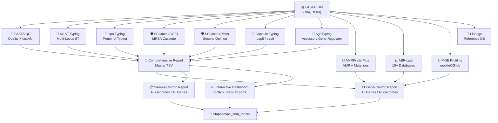

<p align="center">
  
</p>

<div align="center">

# 🔬 StaphScope

### **A species-optimized computational pipeline for rapid, accessible *Staphylococcus aureus* genotyping and surveillance**

#### **Complete MRSA/MSSA genomic analysis in minutes — not hours**

[](CODE_OF_CONDUCT.md)


[](https://doi.org/10.1186/s12864-026-12609-x)

[](https://hub.docker.com/r/bbeckleyhub/staphscope)
[](https://hub.docker.com/r/bbeckleyhub/staphscope)
[](https://hub.docker.com/r/bbeckleyhub/staphscope)
[](#)
[](https://www.linkedin.com/in/brown-beckley-190315319)
[](#)


[](https://github.com/bbeckley-hub/staphscope-typing-tool)
[](https://github.com/bbeckley-hub/staphscope-typing-tool)
[](https://github.com/bbeckley-hub/staphscope-typing-tool)
[](https://github.com/ellerbrock/open-source-badges/)
[](https://github.com/bbeckley-hub/staphscope-typing-tool)

[](https://bbeckley-hub.github.io/staphscope-typing-tool)
[](https://www.sphinx-doc.org/)
[](https://github.com/bbeckley-hub/staphscope-typing-tool/commits)
[](https://github.com/bbeckley-hub/staphscope-typing-tool/graphs/contributors)
[](https://github.com/PyCQA/bandit)

[](https://github.com/psf/black)
[](https://pycqa.github.io/isort/)
[](https://github.com/astral-sh/ruff)
[](https://github.com/pre-commit/pre-commit)
[](https://github.com/bbeckley-hub/staphscope-typing-tool/actions)
[](https://github.com/bbeckley-hub/staphscope-typing-tool/tests)
[](https://gitpod.io/#https://github.com/bbeckley-hub/staphscope-typing-tool)

[](https://github.com/bbeckley-hub/staphscope-typing-tool#performance-benchmarks)
[](https://eskape.bio)
[](https://github.com/bbeckley-hub/staphscope-typing-tool)
[](https://github.com/bbeckley-hub/staphscope-typing-tool)
[](https://github.com/bbeckley-hub/staphscope-typing-tool#ai-integration-guide)

[](https://www.python.org/downloads/)
[](https://docs.conda.io/en/latest/)
[](LICENSE)
[](https://github.com/bbeckley-hub/staphscope-typing-tool/issues)
[](https://github.com/bbeckley-hub/staphscope-typing-tool/stargazers)
[](https://htmlpreview.github.io/?https://bbeckley-hub.github.io/staphscope-typing-tool/#summary)

[](https://scholar.google.com/citations?user=CYNOsqIAAAAJ&hl=en)


[](https://git.io/streak-stats)

**Two ways to use StaphScope:**  
🖥️ **Command-line tool** for high-throughput, local analysis  
🌐 **StaphScope Web** for non-bioinformaticians – [https://eskape.bio](https://eskape.bio)

</div>

---

## 🎉 **What's New in v2.0.0 — September 2026**

### **The Big One. StaphScope 2.0.0**

Nine months, three new modules, one completely rewritten orchestrator, an interactive dashboard that would make a 2015 bioinformatician cry, and a Compare feature that turns "hmm, are these the same bug?" into a definitive answer.

> **Heads up:** v2.0.0 contains **breaking changes**. Module folder names have changed. If you scripted around `modules/sccmec_module/` or `modules/summary_module/`, please read the [Breaking Changes](#-breaking-changes-in-v200) section below. We promise the rename was worth it.

---

### 🆕 **Three Brand-New Analysis Modules**

- **🧬 `mge_module` — Mobile Genetic Element Profiling**  
  Uses **mobileOG-db** (Beatrix-1.6) with **Prodigal** and **DIAMOND** to count protein families across ten functional categories: Integrase, Transfer, Stability, Phage, Replication, IS-associated, ICE-associated, Plasmid-associated, Phage-associated, and Key MGE-signatures. Because you can't understand how resistance *spreads* until you know what's *carrying* it. [Jump to feature deep-dive ↓](#-feature-deep-dives)

- **💊 `capsule_module` — Capsular Polysaccharide Typing**  
  Serotype determination (Type 5 / Type 8) with completeness scoring and per-gene detection. The capsule is what *S. aureus* uses to evade your immune system, and it's a major vaccine target. So yes, it matters — more than people give it credit for. [Jump to feature deep-dive ↓](#-feature-deep-dives)

- **🔬 `sccmec_module_rpet` — A Second SCCmec Opinion**  
  A completely independent SCCmec caller from **Robert A. Petit III** (the original `sccmec` tool, successor to the Staphopia-SCCmec module). Now you get **two callers**: the classic CGE SCCmecFinder and RPet's implementation. When they agree, you can breathe. When they disagree, you have a research project. [Jump to feature deep-dive ↓](#-feature-deep-dives)

---

### 🎨 **The Interactive Visualization Dashboard**

The visualization module has been **completely rewritten** as a single-file, offline-capable **Plotly dashboard** — 10 tabs, cross-filtering, auto-fitting axis labels, and an alert engine.

- **Overview · Typing · QC · AMR · Virulence · MGE · Resistance · Alerts · Story · Compare**
- **Gene deduplication** built in (`mecA` == `MECA` == `mec-A` — because apparently that was too much to ask)
- **Box plots** for N50 / GC / Contigs / Assembly size
- **ANI histogram** with the 95% species boundary line
- **Auto-narrative** — one line per fact, because reading 20 tables is not a lifestyle
- **Story Mode** — the report narrates itself, chapter by chapter
- **Export bundle** — one ZIP with the dashboard, static PNGs/PDFs, and raw CSVs

---

### 🧬 **MLST, spa, and AMR Improvements**

- **MLST** — new `--update-mlst-db` flag; so you could update your mlst database without stress
- **spa** — refreshed Ridom SpaServer database (22,799 spa types, 864 unique repeat patterns)
- **FASTA QC** — now runs **fastANI** for species confirmation
- **AMRFinderPlus** — extended point-mutation handling with master JSON/HTML summary generation

---

### 🙏 **Credit Where It's Due**

A very special thank you to **[Alyssa-Kent](https://github.com/Alyssa-Kent)** — her bug report about `mecC`-positive isolates being mis-classified as MSSA in v1.3.2 was the reason that fix landed, and its downstream logic is still load-bearing in v2.0.0. If you use StaphScope and find *S. aureus* behaving the way it should, a small percentage of the credit is hers. 🍻

---

## 🔥 **Feature Deep-Dives**

### ⚖️ **The Compare Tab — Because "I Think They're the Same Bug" Isn't Good Enough**

Let's be honest about how most outbreak investigations actually happen. Someone has two genomes. They run typing on both. Then they open two HTML files, scroll up and down, mentally diff the MLST, the spa type, the SCCmec, the agr, the capsule, the AMR genes, the virulence genes, the plasmid replicons… and at some point they say *"yeah, I think they're the same."*

That is not a methodology. That's an eyeball.

**The Compare tab replaces the eyeball.** Pick any two isolates, click a button, and get:

1. **A verdict banner** — 🔴 near-identical (≥95% similarity), 🟠 high (≥85%), 🟡 moderate (≥60%), 🔵 distinct
2. **A similarity gauge** — an animated colored ring showing overall match percentage
3. **A typing table** — every field side by side, green pill for match, red pill for diff
4. **Gene content split three ways** — 🟢 shared, 🔵 only in A, 🟣 only in B — per category (AMR, Virulence, BACMET, Plasmids, Mutations)
5. **Full profile expanders** — click any category to see both samples' complete gene lists side by side

**Why this matters for research:**

- **Outbreak confirmation:** Two isolates from the same ward with identical MLST + spa + SCCmec + agr are very likely a transmission pair. Your infection control team will actually do something about that.
- **Discordance analysis:** An ancestor and a resistant descendant look identical in *every* field except one — and that one field tells you which mobile element moved.
- **QC checks:** Two genomes from the same sequencing run that come back as "identical" — one is probably a duplicate. Better to catch that now than publish it.
- **Teaching:** If you have ever tried to explain "why isn't this MSSA?" to a clinician, showing them the Compare tab takes 30 seconds and produces actual agreement.

And when you have more than two samples? **Switch to Cluster Mode.** Automatic pairwise similarity matrix, colour-coded heatmap, automatic cluster detection (union-find algorithm on your own typing data), and a per-cluster summary card showing mean intra-cluster similarity. It's the difference between "we have 40 isolates" and "we have 40 isolates in 6 clusters, 3 of which are outbreak-suspicious."

**A caveat we're proud to state openly:** "Identical typing = transmission pair" is a **hypothesis generator, not a confirmation**. Two isolates can share MLST + spa + SCCmec + agr + capsule and still be unrelated — those markers evolve too slowly for hospital-level resolution. The gold standard remains core-genome SNP distance, which StaphScope doesn't compute (and shouldn't, at this scope). We use the phrase *"possible transmission pair"* deliberately. If we ever lose that hedge, shout at us.

---

### 🦠 **The Virulence Expander in Sample Overview — Because 400 Gene Names Won't Fit in a Cell**

Before v2.0.0, if you wanted to see which virulence genes a specific isolate carried, you had to open the Virulence tab, find the row for each gene, and mentally tick off which genomes were listed. For a cohort of 40 samples, this was a job you did once and never wanted to do again.

Now: **Sample Overview** has a **Virulence column with a click-to-expand count**. Click the number, and a panel slides open showing every VFDB gene that isolate carries — colour-coded, in the same visual language as everything else in the report.

**Why this is more than cosmetic:**

- **Case-by-case drill-down:** When a clinician asks *"what does this isolate actually carry?"*, you have one answer in one place.
- **Teaching tool:** Because explaining PVL + TSST-1 + enterotoxins is a lot easier when you can expand and show the gene list in real time.
- **Screening:** Sort by the count column and the top five highest-virulence isolates float to the top. Useful for prioritising further work.
- **No page reload:** This is a `details/summary` element. The whole report stays one file. Offline. No server. No JavaScript framework. Just HTML.

---

### 📱 **The MGE Tab — Where Resistance Gets a Postal Address**

You have AMR genes. You have virulence genes. You know *what* a genome carries. But *how did it get there?*

**Mobile genetic elements are the answer.** Plasmids, prophages, transposons, integrative conjugative elements — these are the physical vehicles that shuttle resistance and virulence genes between unrelated bacteria. If you don't understand the MGE landscape, you're looking at the mail without ever seeing the postal system.

**What the MGE tab gives you:**

- **Per-sample counts** across ten functional categories:
  | Category | What it counts |
  |---|---|
  | **Integr.** | Integrase — chromosomal integration machinery |
  | **Transfer** | Conjugation (T4SS), the actual horizontal-transfer system |
  | **Stab.** | Partitioning, toxin-antitoxin — plasmid persistence |
  | **Phage** | Complete bacteriophage proteins |
  | **Repl.** | Replication initiators |
  | **IS-assoc.** | Insertion sequences / transposases |
  | **ICE-assoc.** | Integrative conjugative elements (SCCmec's cousin) |
  | **Plasmid-assoc.** | Plasmid backbone and maintenance |
  | **Phage-assoc.** | Prophage / lysogeny modules |
  | **Key MGE-assoc.** | Curated high-confidence subset |

- **Aggregate profiles by typing** — mean MGE load per ST, per SCCmec type, per agr type, per capsule type. High MGE burden in one lineage but not another is a real signal.
- **Top-N views** — the five isolates with the most IS-associated proteins, plasmid proteins, or high-confidence MGE signatures.
- **Education cards** — because "what is an IS element and why do I care?" is a question that deserves a proper answer.

**What it helps with:**

- **Resistance dissemination:** A plasmid-associated gene cluster in two unrelated STs is a smoking gun for horizontal transfer. Group the MGE table by MLST and see it.
- **Virulence acquisition:** PVL and TSST-1 are often prophage-borne. High phage-associated counts in a virulent lineage are consistent with a lysogeny event.
- **Persistent infections:** Strong stability systems (parAB, toxin-antitoxin) let plasmids survive without selection. If you see this in a clinical cohort, take note.
- **Outlier detection:** An isolate with 2× the cohort's MGE load is either something new, or something broken. Either way you should look.

**A word of honesty:** mobileOG-db counts protein *signatures*, not reconstructed elements. Multiple proteins from the same element produce multiple hits, and some categories (replication, recombination) also fire on chromosomal genes. That's why we use the word *"signatures"* everywhere and warn against interpreting each hit as an independent MGE. If you want element-level claims, you need co-localization analysis — which is a bioinformatics project, not a column in a dashboard.

---

### 💊 **The Capsule Tab — Because Phagocytes Have Feelings Too**

*S. aureus* wears a sugar coat. Specifically, it produces one of two dominant capsular polysaccharides: **Type 5** or **Type 8**. This coat is what stops your neutrophils from phagocytosing it efficiently. It's also one of the primary targets for investigational *S. aureus* vaccines.

**Why typing the capsule matters:**

- **Vaccine coverage:** If a candidate vaccine targets Type 5 and your entire cohort is Type 8, that vaccine is going to have a bad day. Knowing the serotype distribution in your region is a real public-health input.
- **Lineage correlation:** Type 5 is common in MSSA. Type 8 dominates MRSA ST8 and ST239 lineages. If you're tracking a clone, the capsule is a low-cost marker.
- **Immune-evasion potential:** Capsule-positive isolates resist phagocytosis better than capsule-negative ones. When you see a persistent infection and the isolate is Type 5 or Type 8, the capsule is a plausible contributor.
- **Cross-tabulation:** The Capsule tab cross-tabs with MLST, spa, agr, SCCmec-CGE, and SCCmec-Subtype. You can answer *"which lineages carry Type 5 vs Type 8 in our setting?"* in three clicks.

**The visual touch:** In the Sample Overview table, **Type 5 is green** and **Type 8 is red** everywhere they appear. Because if you're going to look at forty rows of a table, you may as well have your eyes do the colour-matching for you.

---

### 🛡️ **The SCCmec Tab — Because One Opinion Is Never Enough**

SCCmec typing tells you which *mec* cassette a MRSA isolate carries — Types I through XIII, with a fine-grained **subtype** on top (IIa, IVc, etc.). It's the single most important structural marker of MRSA lineage evolution, and it has, historically, been determined by exactly one tool.

Now there are two.

**The tab shows you CGE SCCmecFinder and RPet's `sccmec` side by side**, with a normalizer that understands they use different naming conventions (`SCCmec_type_II(2A)` from CGE and `Type II(2A)` from RPet are the same cassette — obviously). You get:

- **CGE SCCmec type** distribution, cross-tabbed with ST, spa, agr, and capsule
- **RPet SCCmec type** distribution, same cross-tabs
- **SCCmec subtype** distribution — the finest-grained layer available

**Why two callers matter:**

- **Cross-validation:** When both callers agree on a cassette type, you have high confidence. When they disagree, you have a genuine signal — maybe a rare cassette, maybe an assembly issue, maybe an interesting biology story.
- **Subtype resolution:** RPet's subtype call (IVa vs IVc, IIa vs IIb) is often finer than CGE's. For regional clone tracking, subtypes are what you actually need.
- **Publication-ready:** Reviewers ask "which SCCmec caller did you use?" Having a two-caller consensus answer is a much stronger response than "we used the one we like."

The tab highlights genuine disagreements — but only *genuine* ones. Naming-format differences (which are the same biological cassette) are silently normalized. Nobody needs an alert telling them `SCCmec_type_II(2A)` is different from `Type II(2A)`.

---

## 📋 **Table of Contents**

**🚀 Getting Started**
- [🎉 What's New in v2.0.0](#-whats-new-in-v200--september-2026)
- [🎯 Overview](#-overview)
- [✨ Key Features](#-key-features)
- [⚡ Quick Start (CLI)](#-quick-start-cli)
- [🔧 Installation (CLI)](#-installation-cli)
- [🐳 Docker & Singularity](#-staphscope-docker--singularity-usage--avoid-the-padlock-)

**🧬 Using StaphScope**
- [🚀 Usage Guide (CLI)](#-usage-guide-cli)
- [📁 Output Structure](#-output-structure)
- [🔍 Analytical Modules](#-analytical-modules)
- [📊 Sample Integrated Reports](#-sample-integrated-reports)
- [🔥 Feature Deep-Dives](#-feature-deep-dives)

**🌐 Beyond the CLI**
- [🌐 StaphScope Web Platform](#-staphscope-web-platform)
- [🧰 StaphScope Toolkit](#-staphscope-toolkit--itol-metadata-made-easy)

**🔬 Reference**
- [🔗 Integrated External Tools](#-integrated-external-tools--dependencies)
- [📈 Performance Benchmarks](#-performance-benchmarks)
- [🔬 Validation & Accuracy](#-validation--accuracy)
- [🚨 Breaking Changes](#-breaking-changes-in-v200)

**🤝 Community & Support**
- [🤖 AI Integration Guide](#-ai-integration-guide)
- [🔮 Future Development](#-future-development)
- [❓ FAQ](#-frequently-asked-questions)
- [🐛 Troubleshooting](#-troubleshooting)
- [📚 Citation](#-citation)
- [🙏 Acknowledgements](#-acknowledgements)
- [👥 Authors & Contact](#-authors--contact)
- [📄 License](#-license)
- [📚 Third-Party Tool Citations](#-third-party-tool-citations)
- [🤖 AI Disclosure](#-ai-disclosure)

---

## 🎯 **Overview**

**StaphScope** is an automated, locally-executable computational pipeline designed specifically for comprehensive *Staphylococcus aureus* genomic surveillance. It addresses the critical bottleneck in MRSA research by integrating **ten essential genotyping and profiling methods** into a single, cohesive workflow.

### 🌍 **The Problem**
- **Fragmented Bioinformatics**: Traditional MRSA analysis requires 5+ separate tools with conflicting dependencies.
- **Resource Barriers**: Web-based services need constant internet and raise data privacy concerns.
- **Time Constraints**: Generalist platforms take hours; outbreaks need answers in minutes.
- **Interpretation Challenges**: Raw data without epidemiological context limits actionable insights.

### 💡 **Our Solution**
StaphScope delivers:
- **✅ Single-command installation** via Conda.
- **✅ 10-14 minute complete analysis** (24 samples, 16 cores).
- **✅ 100% local execution** with data privacy.
- **✅ Intelligent resource management** using Python's psutil library.
- **✅ Interactive HTML reports** with epidemiological context.
- **✅ Automated MRSA/MSSA classification** with confidence scoring.
- **✅ Web-based interface** for non-bioinformaticians.

**Perfect for**: Clinical labs, outbreak investigations, research studies, and public health surveillance.

---

## ✨ **Key Features**

### 🔬 **Core Analytical Modules**

| Module | 🎯 Purpose | 📊 Key Outputs | ⚡ Speed |
|--------|------------|----------------|----------|
| **FASTA QC** | Quality control + fastANI species confirmation | N50, GC%, contig stats, ANI %, species | <30 sec |
| **MLST Typing** | Phylogenetic classification via 7 housekeeping genes | ST, CC, allele profiles | <1 min |
| ***spa* Typing** | Hypervariable region analysis of protein A gene | *spa* type, repeat patterns | <1 min |
| **SCC*mec* Typing (CGE)** | Methicillin resistance cassette characterization | SCC*mec* type (I-XIII), confidence scores | 1-2 min |
| **SCC*mec* Typing (RPet)** | Independent second-opinion caller | SCC*mec* type + subtype (IVa, IIb, ...) | 1-2 min |
| **Capsule Typing** | cap5/cap8 serotype determination | Type 5 / Type 8, completeness score | <30 sec |
| **Agr Typing** | Accessory gene regulator (agr) type determination | agr type I-IV, group, status | <1 min |
| **AMR Profiling** | Comprehensive resistance gene detection | 5,000+ AMR genes, risk categorization | 2-3 min |
| **ABRicate Screening** | Multi-database virulence/plasmid detection (10 DBs) | Plasmid replicons, virulence factors | 3-4 min |
| **MGE Profiling** | mobileOG-db per-sample category counts | 10 categories, key MGE signatures | 2-3 min |
| **Visualization Suite** | Interactive dashboard + publication plots | HTML dashboard, PNG, PDF, SVG, ZIP bundle | 1-2 min |
| **Lineage Database** | Global epidemiological context | 50 major lineages, geographical distribution | Instant |

---

### 📊 **Sample Integrated Reports**

Every report in one interactive hub — browse, search, preview, and open any StaphScope output. **[Open the Live Report Hub →](https://bbeckley-hub.github.io/staphscope-typing-tool/)**

| Report Type | What it shows | Direct link |
|---|---|---|
| **📄 Comprehensive Report** | Master typing table — MLST, spa, SCCmec (CGE + RPet + subtype), agr, capsule, MRSA/MSSA | [](https://bbeckley-hub.github.io/staphscope-typing-tool/staphscope_comprehensive_report.html) |
| **🧬 Gene-Centric Report** | Every AMR / virulence / BACMET / plasmid / mutation gene, with all genomes that carry it | [](https://bbeckley-hub.github.io/staphscope-typing-tool/staphscope_ultimate_gene_centric_report.html) |
| **📋 Sample-Centric Report** | Per-isolate lazy-loaded boxes with a full Compare &amp; Cluster tab | [](https://bbeckley-hub.github.io/staphscope-typing-tool/staphscope_ultimate_sample_centric_report.html) |
| **📈 Interactive Dashboard** | Plotly dashboard — Overview, Typing, QC, AMR, Virulence, MGE, Alerts, Story, Compare | [](https://bbeckley-hub.github.io/staphscope-typing-tool/staphscope_dashboard.html) |
| **🔬 MLST Summary** | Sequence types + allele profiles across your cohort | [](https://bbeckley-hub.github.io/staphscope-typing-tool/mlst_summary.html) |
| **🧬 spa Summary** | spa types + repeat patterns | [](https://bbeckley-hub.github.io/staphscope-typing-tool/spa_summary.html) |
| **🛡️ SCCmec (CGE)** | Cassette type, *mec* class, *ccr* complex | [](https://bbeckley-hub.github.io/staphscope-typing-tool/staphscope_sccmec_cge_summary.html) |
| **🛡️ SCCmec (RPet)** | Independent caller + fine-grained subtype | [](https://bbeckley-hub.github.io/staphscope-typing-tool/staphscope_sccmec_rpet_summary.html) |
| **🧬 agr Summary** | agr types I–IV (AgrVATE) | [](https://bbeckley-hub.github.io/staphscope-typing-tool/agr_summary.html) |
| **📏 FASTA QC** | N50 / GC / contigs + fastANI species confirmation | [](https://bbeckley-hub.github.io/staphscope-typing-tool/FASTA_QC_summary.html) |
| **💊 Capsule Typing** | cap5 / cap8 serotype with completeness score | [](https://bbeckley-hub.github.io/staphscope-typing-tool/staphscope_capsule_summary.html) |
| **📱 MGE Profile** | mobileOG-db counts across 10 functional categories | [](https://bbeckley-hub.github.io/staphscope-typing-tool/staphscope_mge_summary.html) |
| **🔍 Per-Sample MGE** | Example deep-dive — one page per isolate | [](https://bbeckley-hub.github.io/staphscope-typing-tool/GCA_000160335.2_mge.html) |

> **Note:** Reports may take a few seconds to load. For the best experience, download the HTML files and open them locally — every report is fully self-contained and offline-capable.
---

### 🛡️ **MRSA-Specific Innovations**
- **Automated MRSA Classification**: Based on concurrent *mecA/mecC* + SCC*mec* detection.
- **Dual SCCmec Caller Consensus**: CGE + RPet, with automatic naming-format normalization.
- **Clinical Gene Flagging**: Automatic highlighting of PVL, enterotoxins, *van* genes.
- **Risk Assessment**: Categorizes genes as 'Critical Risk' (e.g., *mecA*, *vanA*) or 'High Risk'.
- **Cross-Genome Pattern Discovery**: Summarizes gene frequencies across entire sample sets.
- **Cluster Detection**: Union-find algorithm on typing data to auto-detect transmission clusters.
- **Curated Lineage Database**: 50 major lineages with HA-MRSA, CA-MRSA, LA-MRSA classifications.

---

## 📊 StaphScope Workflow


---

## 🧰 **StaphScope Toolkit – iTOL Metadata Made Easy**

**Data wrangling got you down?** We built a companion toolkit that automatically generates iTOL-ready annotation files from your StaphScope outputs — **no Excel gymnastics required.**

<p align="center">
  
</p>

<p align="center"><em>Core-genome phylogeny annotated with MLST, spa, SCCmec, agr, capsule, AMR, and virulence metadata — generated automatically from StaphScope outputs.</em></p>

### **What it does**

- ✅ Converts your StaphScope CSVs into **iTOL colour strips** and **binary matrices**
- ✅ Handles **MLST, spa, SCCmec, agr, MRSA status, AMR genes, virulence factors, mutations, BacMet, and plasmid replicons**
- ✅ **Auto-selects top genes/mutations** so you never get empty files
- ✅ Customise with `--top_st`, `--custom_amr`, or a YAML config file

### **Quick start**

```bash
# Clone the toolkit
git clone https://github.com/bbeckley-hub/staphscope-toolkit.git
cd staphscope-toolkit

# Install dependencies
pip install -r requirements.txt

# Generate iTOL metadata from your StaphScope run
python staphscope_itol.py --input_dir /path/to/Staphscope_final_report
```

Drag and drop the generated files into [iTOL](https://itol.embl.de) — that's it.

> 📖 **[Full documentation & examples →](https://github.com/bbeckley-hub/staphscope-toolkit)**

> *"From 3 hours of Excel gymnastics to 30 seconds of drag-and-drop. You're welcome."* 😉
---

## 🌐 **StaphScope Web Platform**

StaphScope is a core component of the **ESKAPE AMR Platform** – a unified web suite for species‑optimized genomic surveillance.

### **Key Web Features**
- ✅ **Drag‑and‑drop file upload** (single, multiple, or ZIP archives)
- ✅ **Module selection** – choose which analyses to run
- ✅ **Real‑time progress monitoring** with live logs
- ✅ **Beautiful HTML reports** with interactive visualizations
- ✅ **Download all results as a single ZIP**
- ✅ **Responsive design** – works on desktop and tablet
- ✅ **No installation required** – works in any modern browser

### **Quick Access**
> 🌐 **Try StaphScope Web today:** [https://eskape.bio](https://eskape.bio)  
> 📦 **Web Repository:** [https://github.com/bbeckley-hub/eskape-web-platform](https://github.com/bbeckley-hub/eskape-web-platform)

*Note: The web version limits uploads to 10 files per job. For larger datasets, use the CLI.*  
*Note: Currently hosted on personal infrastructure; availability may vary as we work toward sustainable 24/7 hosting.*

---

## ⚡ **Quick Start (CLI)**

### **Install in 60 seconds**
```bash
# Method 1: Conda (Recommended)
conda create -n staphscope -c conda-forge -c bioconda staphscope -y
conda activate staphscope

# Method 2: Mamba (Faster)
mamba create -n staphscope -c conda-forge -c bioconda staphscope -y
mamba activate staphscope

# Method 3: From source
git clone https://github.com/bbeckley-hub/staphscope-typing-tool.git
cd staphscope-typing-tool
conda env create -f environment.yml
conda activate staphscope
pip install -e .
```

### **Run your first analysis**
```bash
# Single genome
staphscope -i genome.fasta -o results/

# Batch processing (24 genomes)
staphscope -i "*.fna" -o batch_results --threads 16
# Complete in ~14 minutes! 🎉
```

---

## 🔧 **Installation (CLI)**

### **System Requirements**
| Resource | Minimum | Recommended | Production |
|----------|---------|-------------|------------|
| **CPU Cores** | 2 | 8+ | 16+ |
| **RAM** | 4 GB | 8 GB | 16 GB |
| **Storage** | 2 GB | 10 GB | 50 GB+ |
| **OS** | Linux, macOS, WSL2 | Linux | Linux Cluster |

### **Step-by-Step Installation**

#### **1. Install Miniconda (if needed)**
```bash
wget https://repo.anaconda.com/miniconda/Miniconda3-latest-Linux-x86_64.sh
bash Miniconda3-latest-Linux-x86_64.sh
source ~/.bashrc
```

#### **2. Install StaphScope**
```bash
conda config --add channels conda-forge
conda config --add channels bioconda

conda create -n staphscope -c conda-forge -c bioconda staphscope -y
conda activate staphscope

staphscope --help
```

#### **3. Update Databases (Recommended)**
```bash
# ABRicate databases
abricate --setupdb

# AMR database (first run or manual update)
staphscope --update-amr-db          # incremental
staphscope --force-update-amr-db    # full overwrite

# MLST database (choose one)
staphscope --pull-mlst-db           # from GitHub (no credentials)
staphscope --update-mlst-db         # from PubMLST only sareus scheme updates (API key required)
```

---

## 🐳 **StaphScope Docker & Singularity Usage – avoid the padlock 🔓**

Docker and Singularity users get **everything pre-installed** — no first-run database setup, no `--pull-mlst-db`, no `--update-amr-db`, no `abricate --setupdb`. Every database (MLST scheme, AMRFinderPlus, ABRicate DBs, mobileOG-db) and every tool (BLAST, DIAMOND, Prodigal, fastANI, agrVATE) is baked into the image. **Pull and run.**

> **Conda users:** you must run `staphscope --pull-mlst-db` and `staphscope --update-amr-db` once after install. Docker and Singularity users skip that entirely.

---

### **Docker (laptops, workstations, cloud VMs)**

Docker runs containers as `root` by default, so files written to bind-mounted directories come out owned by `root:root`. **Fix: add `-u $(id -u):$(id -g)`.**

```bash
# Pull the image
docker pull bbeckleyhub/staphscope:2.0.0

# Run (no padlock, no sudo chown)
docker run --rm \
  -u $(id -u):$(id -g) \
  -v $(pwd):/data \
  bbeckleyhub/staphscope:2.0.0 \
  -i "/data/*.fna" -o /data/output -t 4
```

- `-u $(id -u):$(id -g)` → files owned by **you**
- `-v $(pwd):/data` → mounts your current dir as `/data` inside the container
- `-i "/data/*.fna"` → uses the **container path**, not your host path
- `-o /data/output` → lands at `./output/` on your host

Verify:
```bash
docker run --rm bbeckleyhub/staphscope:2.0.0 --help
```

Interactive shell (for debugging):
```bash
docker run --rm -it bbeckleyhub/staphscope:2.0.0 bash
```

Image size: ~1.7 GB compressed / ~8 GB on disk.

---

### **Singularity / Apptainer (HPC clusters) — recommended for HPC**

**HPC users should use Singularity, not Docker.** HPC login and compute nodes don't run the Docker daemon; Singularity (or its successor Apptainer) is the standard. Same SIF format, rootless by default, and no UID juggling — it runs as your real user automatically.

#### 1. Load the runtime

Module names vary by cluster — check with `module avail`:

```bash
# Newer clusters — Apptainer
module load apptainer

# Older clusters — Singularity
module load containers/singularity/3.6.4

# Pulling the image ALSO needs mksquashfs from squashfs-tools
module load squashfs-tools/4.4

singularity --version   # or: apptainer --version
```

#### 2. Pull the image (one-time, needs internet on login node)

```bash
singularity pull staphscope_2.0.0.sif docker://bbeckleyhub/staphscope:2.0.0
```

Creates `staphscope_2.0.0.sif` (~1.7 GB) in the current directory. **`squashfs-tools` is only needed for the pull, not for running.**

#### 3. Run

```bash
singularity run --bind $(pwd):/data \
  staphscope_2.0.0.sif \
  -i "/data/*.fna" -o /data/output -t 16
```

- `--bind $(pwd):/data` — HPC equivalent of Docker's `-v`
- **No `-u` needed** — Singularity runs as your real UID
- **No `-e HOME=` needed** — Singularity uses your real `$HOME`, so MLST and AMR caches persist between runs

> **Use `singularity run`, not `singularity exec`.** The image's entrypoint sets up `PATH` and `LD_LIBRARY_PATH` for the conda environment — `run` invokes it, `exec` skips it, which will break AMRFinderPlus.

#### 4. SLURM job script

```bash
#!/bin/bash
#SBATCH --job-name=staphscope
#SBATCH --cpus-per-task=16
#SBATCH --mem=32G
#SBATCH --time=04:00:00
#SBATCH --output=staphscope_%j.log

module load containers/singularity/3.6.4

cd $SLURM_SUBMIT_DIR

singularity run --bind $(pwd):/data \
  /path/to/staphscope_2.0.0.sif \
  -i "/data/*.fna" \
  -o /data/output \
  -t ${SLURM_CPUS_PER_TASK}
```

#### 5. PBS / Torque job script

```bash
#!/bin/bash
#PBS -N staphscope
#PBS -l nodes=1:ppn=16
#PBS -l walltime=04:00:00
#PBS -j oe

module load containers/singularity/3.6.4

cd $PBS_O_WORKDIR

singularity run --bind $(pwd):/data \
  /path/to/staphscope_2.0.0.sif \
  -i "/data/*.fna" \
  -o /data/output \
  -t 16
```

#### 6. HPC notes

- **No `module load` needed at runtime** — only the login-node pull requires `squashfs-tools`. Compute nodes just need Singularity.
- **Pull once, run everywhere** — the SIF is a single self-contained file. Share it on your scratch filesystem and every compute node can use it.
- **Small home quota?** Redirect the Singularity build cache to scratch:
  ```bash
  export SINGULARITY_CACHEDIR=/scratch/$USER/singularity_cache
  ```
- **MLST / AMR caches** live under `$HOME/.local/share/staphscope/` by default. On tight home quotas:
  ```bash
  export STAPHSCOPE_MLST_DB=/scratch/$USER/staphscope/mlst_db
  ```

#### 7. Troubleshooting

| Error | Fix |
|---|---|
| `mksquashfs: executable file not found` | `module load squashfs-tools/4.4` before `singularity pull` |
| `manifest unknown` | The Docker tag hasn't been pushed, or the name is wrong — check https://hub.docker.com/r/bbeckleyhub/staphscope/tags |
| `singularity: command not found` | `module avail 2>&1 \| grep -i singularity` to find the module name |
| Pull hangs (blocked registry) | Download the SIF from the GitHub release page instead |
| `BUNDLED AMRfinderPlus not properly installed` | You used `singularity exec` — use `singularity run` instead |

---

### **Which should you use?**

| Platform | Recommendation | Command pattern | Output ownership |
|---|---|---|---|
| **Laptop / workstation** | Docker | `docker run --rm -u $(id -u):$(id -g) -v "$PWD:/data" …` | You |
| **HPC login + compute nodes** | **Singularity (or Apptainer)** | `singularity run --bind "$PWD:/data" staphscope.sif …` | You (automatic) |
| **Cloud VM** | Either — Docker is simpler | see above | You |
| **Shared cluster without Docker** | Singularity | see above | You (automatic) |

**The rule:** Docker on machines where you control the daemon; Singularity on shared HPC systems where you don't.

---

## 🔗 **Integrated External Tools & Dependencies**

| Tool/Database | Purpose | Source | License |
|---------------|---------|--------|---------|
| **MLST** | Multi-locus sequence typing | [tseemann/mlst](https://github.com/tseemann/mlst) | GPL v2 |
| **ABRicate** | Mass screening for resistance/virulence | [tseemann/abricate](https://github.com/tseemann/abricate) | GPL v2 |
| **AMRFinderPlus** | Antimicrobial resistance gene detection | [ncbi/amr](https://github.com/ncbi/amr) | Public Domain |
| **SCCmecFinder** | SCCmec typing (CGE caller) | [genomicepidemiology/Sccmecfinder](https://bitbucket.org/genomicepidemiology/Sccmecfinder) | Apache-2.0 |
| **sccmec (RPet)** | SCCmec typing (RPet caller) | [rpetit3/sccmec](https://github.com/rpetit3/sccmec) | MIT |
| **AgrVATE** | Agr typing | [VishnuRaghuram94/AgrVATE](https://github.com/VishnuRaghuram94/AgrVATE) | MIT |
| **spa typing** | *spa* gene typing | [spa.ridom.de](https://spa.ridom.de/) | Free for academic use |
| **PubMLST** | MLST allele database | [pubmlst.org](https://pubmlst.org/organisms/staphylococcus-aureus) | Open access for research |
| **fastANI** | Species-level ANI confirmation | [ParBLiSS/FastANI](https://github.com/ParBLiSS/FastANI) | Apache-2.0 |
| **mobileOG-db** | Mobile genetic element DB | [clb21565/mobileOG-db](https://github.com/clb21565/mobileOG-db) | MIT |
| **Prodigal** | Prokaryotic gene prediction | [hyattpd/Prodigal](https://github.com/hyattpd/Prodigal) | GPL v3 |
| **DIAMOND** | Fast protein alignment | [bbuchfink/diamond](https://github.com/bbuchfink/diamond) | BSD-3 |

---

## 🚀 **Usage Guide (CLI)**

### **Basic Commands**
```bash
# Single genome
staphscope -i genome.fasta -o results/

# Batch processing with wildcards
staphscope -i "*.fna" -o results_2025 --threads 8

# Skip specific modules
staphscope -i sample.fna -o results --skip-spa --skip-lineage --skip-agr

# Skip the new SCCmec RPet caller
staphscope -i "*.fna" -o results --skip-sccmec-rpet

# Skip the new capsule module
staphscope -i "*.fna" -o results --skip-capsule

# Skip the new MGE profiler
staphscope -i "*.fna" -o results --skip-mge

# AMR with custom thresholds and no mutations
staphscope -i "*.fna" -o results --amr-min-identity 0.95 --amr-min-coverage 0.9 --skip-amr-mutations

# Force AMR database update before analysis
staphscope -i "*.fna" -o results --amr-force-update
```

### **Input Formats**
- Accepted: `.fna`, `.fasta`, `.fa`, `.fn`
- Required: Assembled genomes (contigs or complete)
- Batch patterns: `*.fasta`, `sample_*.fna`, etc.

### **Real-World Examples**

#### **Clinical Laboratory Setting**
```bash
# Daily surveillance of 12 isolates
staphscope -i "daily_isolates/*.fasta" -o /mnt/shared/surveillance/$(date +%Y%m%d) --threads 12
# Complete in ~8 minutes
```

#### **Outbreak Response**
```bash
# Urgent investigation (8 suspected cases) – skip lineage to save time
staphscope -i "outbreak/*.fasta" -o /tmp/urgent_analysis --skip-lineage
# Results in ~4 minutes
```

#### **Minimal run (typing only, no visualization)**
```bash
staphscope -i "*.fna" -o results --skip-visualization --skip-sample-centric
```

---

## 📁 **Output Structure**

```
batch_results/
├── abricate_results/              # Multi-database screening (10 DBs)
├── agr_results/                   # Agr typing results
├── capsule_results/               # Capsule typing results
├── fasta_qc_results/              # FASTA QC + fastANI species confirmation
├── lineage_results/               # Phylogenetic lineage reference
├── mge_results/                   # Mobile genetic element profiling
├── mlst_results/                  # MLST typing
├── sccmec_cge_results/            # SCCmec (CGE caller)
├── sccmec_rpet_results/           # SCCmec (RPet caller)
├── spa_results/                   # spa typing
├── staph_amrfinder_results/       # AMR gene profiling + mutations
├── Staphscope_final_report/       # ← Consolidated reports
│   ├── staphscope_comprehensive_report.html
│   ├── staphscope_comprehensive_report.json
│   ├── staphscope_comprehensive_report.tsv          # ← Master typing TSV
│   ├── STAPHSCOPE_ULTIMATE_GENE_CENTRIC_REPORTS/
│   │   ├── staphscope_ultimate_gene_centric_report.html
│   │   ├── staphscope_ultimate_gene_centric_report.json
│   │   ├── amr_genes.csv
│   │   ├── virulence_genes.csv
│   │   ├── bacmet_genes.csv
│   │   ├── mutations.csv
│   │   ├── plasmid_replicons.csv
│   │   ├── mge_profile.csv
│   │   ├── sample_overview.csv
│   │   ├── pattern_discovery.csv
│   │   └── fasta_qc.csv
│   └── STAPHSCOPE_ULTIMATE_SAMPLE_CENTRIC_REPORTS/
│       ├── staphscope_ultimate_sample_centric_report.html
│       ├── staphscope_ultimate_sample_centric_report.json
│       └── ...
├── STAPHSCOPE_VISUALIZATIONS/     # Interactive dashboard + static exports
│   ├── staphscope_dashboard.html
│   ├── PNG/  PDF/  SVG/  DATA/
│   ├── staphscope_visualization_report.txt
│   └── staphscope_visualizations_bundle.zip
└── staphscope_run.log             # Detailed log file
```

---

## 🔍 **Analytical Modules**

### **1. FASTA QC + fastANI Species Confirmation**
- **Metrics**: N50/N75/N90, L50/L75/L90, GC content, total length, contig count
- **Species check**: fastANI against a reference panel; colour-coded pass/fail (ANI ≥ 95%)
- **Outputs**: HTML, TSV, JSON

### **2. MLST Typing**
- **Database**: PubMLST *S. aureus*
- **Method**: BLAST-based allele calling
- **Output**: ST, CC, 7-gene profile, epidemiological context

### **3. *spa* Typing**
- **Database**: Ridom *spa* repeat database (refreshed)
- **Method**: BLAST against repeat sequences
- **Output**: *spa* type, repeat pattern, alignment metrics

### **4. SCC*mec* Typing (CGE + RPet)**
- **CGE caller**: SCCmecFinder — the classic CGE implementation
- **RPet caller**: *sccmec* by Robert A. Petit III — independent second opinion
- **Output**: SCC*mec* type (I-XIII), subtype (IVa, IIb, ...), confidence scores, *mec*/*ccr* complexes

### **5. Capsule Typing**
- **Method**: cap5/cap8 locus detection with completeness scoring
- **Output**: Type 5 / Type 8 / not-typed, per-gene list

### **6. Agr Typing**
- **Method**: AgrVATE (Raghuram et al., 2022)
- **Output**: agr type (I-IV), group, match score, status

### **7. AMR Profiling**
- **Tool**: NCBI-AMRFinderPlus v4.2.7
- **Coverage**: 5,000+ AMR genes
- **Risk Assessment**: Critical Risk (*mecA*, *vanA*, *cfr*), High Risk (*erm*, *tetM*)
- **Mutation reporting**: All point mutations (synonymous + non-synonymous) by default

### **8. ABRicate Screening**
- **Databases**: VFDB, ResFinder, CARD, PlasmidFinder, MegaRes, NCBI, ARG-ANNOT, ECOH, EcoLi_VF, BacMet2
- **Thresholds**: ≥80% identity and coverage (configurable)
- **Clinical Flags**: PVL, enterotoxins, *van* genes

### **9. MGE Profiling**
- **Tool**: MGEFinder (mobileOG-db Beatrix-1.6 + Prodigal + DIAMOND)
- **Categories**: Integr., Transfer, Stab., Phage, Repl., IS-assoc., ICE-assoc., Plasmid-assoc., Phage-assoc., Key MGE-assoc.
- **Output**: Per-sample category counts + aggregate profiles by typing

### **10. Interactive Visualization Suite**
- **Libraries**: Plotly (interactive HTML), matplotlib + seaborn (static PNG/PDF/SVG)
- **Dashboard tabs**: Overview · Typing · QC · AMR · Virulence · MGE · Resistance · Alerts · Story · Compare
- **Feature spotlight**: Cluster detection, cross-filtering, auto-fit labels, gene deduplication

### **11. Lineage Database**
- **Content**: 50 major *S. aureus* lineages (18 HA-MRSA, 19 CA-MRSA, 7 LA-MRSA)
- **Metadata**: Geographical distribution, clinical significance, outbreak potential

---

## 📈 **Performance Benchmarks**

| System | Samples | Time | Speed vs Bactopia |
|--------|---------|------|-------------------|
| Laptop (2 cores, 8GB) | 1 | 2m 33s | 5× faster |
| Laptop (2 cores, 8GB) | 24 | 28m 17s | 6× faster |
| Workstation (16 cores, 16GB) | 1 | 1m 31s | 8× faster |
| Workstation (16 cores, 16GB) | 24 | 14m 34s | 10× faster |
| Workstation (16 cores, 16GB) | 100 | ~60m | 12× faster |

**Note:** v2.0.0 adds three modules (capsule, sccmec-RPet, MGE) and the interactive dashboard. Timings above reflect the analysis modules; visualization adds ~1–2 minutes depending on cohort size.

---

## 🔬 **Validation & Accuracy**

### **Reference Strain Validation**
**100% concordance** with gold‑standard reference genomes:

| Reference Strain | Expected Type | StaphScope Result |
|------------------|---------------|-------------------|
| USA300 | ST8–t008–IV(2B) | ✅ ST8–t008–IV(2B) |
| N315 | ST5–t002–II(2A) | ✅ ST5–t002–II(2A) |
| MRSA252 | ST36–t018–II(2A) | ✅ ST36–t018–II(2A) |
| TW20 | ST239–t037–III(3A) | ✅ ST239–t037–III(3A) |
| NCTC8325 | ST8–t211–None | ✅ ST8–t211–Not Assigned |

### **Clinical Isolate Analysis (n=24)**
- **MRSA**: 21 isolates (87.5%)
- **MSSA**: 3 isolates (12.5%)
- **Dominant STs**: ST5 (9), ST8 (5), ST22 (2)
- **Agr Types**: I (10), II (12), III (2)
- **Critical Genes**: *mecA* (21), *mecC* (1), *fosB* (20)
- **PVL**: 7 isolates (29.2%), all ST8/ST59
- **Plasmids**: 14/24 genomes (58.3%) with plasmid replicons

---

## 🤖 **AI Integration Guide**

StaphScope reports are structured with clear tables and organized data that AI can easily understand.

### 🚀 Quick Start
1. **Install any AI browser extension** (ChatGPT, Claude, Gemini)
2. **Open your report**: `staphscope_dashboard.html` or `staphscope_ultimate_gene_centric_report.html`
3. **Select text** in any section (AMR Genes, MLST Analysis, etc.)
4. **Right-click → Ask AI** with your question

### 💡 Example Questions

**For Compare tab:**
- "These two samples share MLST, spa, and SCCmec. What is the probability they are a transmission pair?"
- "Which genes differ between Sample A and Sample B, and what does that tell me?"

**For MGE tab:**
- "Which lineage carries the highest mean plasmid-associated protein count? Does that suggest active plasmid circulation?"
- "Is the MGE burden in ST239 higher than in ST5 in this cohort?"

**For AMR + Virulence:**
- "Which samples carry PVL toxin? Are they associated with specific STs or agr types?"
- "List all samples with vancomycin resistance genes and their SCCmec types."

**For Cluster detection:**
- "Show me the samples in Cluster 3 and tell me their shared typing profile."

> *"AI provides powerful insights but always verify critical findings with domain experts."*

---

## 🔮 **Future Development**

### **🚀 Upcoming Features (2026-2027)**
- **Raw read support** – Direct FASTQ analysis with integrated assembly (Shovill).
- **Machine learning module** – Outbreak prediction, phenotype inference, risk scoring.
- **Real‑time database updates** – Live synchronization of lineage and AMR databases.
- **Plugin system** – Community‑contributed analysis modules.
- **Expanded ESKAPE coverage** – Porting StaphScope's architecture to other ESKAPE pathogens.

---

## ❓ **Frequently Asked Questions**

**Q: Is StaphScope free to use?**  
A: Yes! Open‑source under MIT License. Free for academic, clinical, and commercial use.

**Q: What makes StaphScope different from other tools?**  
A: *S. aureus*-optimized, integrates 10 analysis types including dual SCCmec callers, and runs 8-10× faster than generalist platforms.

**Q: Can I use StaphScope for clinical diagnosis?**  
A: StaphScope is a research tool. While highly accurate, results should be validated with orthogonal methods for clinical decision‑making.

**Q: Which version should I use – CLI or Web?**  
A: Use the **Web version** for convenience, small batches, and graphical interface. Use the **CLI** for large batches, pipeline integration, or when working with sensitive data locally.

**Q: What is the Compare tab and how is it different from just looking at two tables?**  
A: It computes a similarity score across all typing fields plus gene-content overlap, produces a verdict banner, and highlights every mismatched row. It's the difference between eyeballing and being able to defend your call in a meeting.

**Q: Why two SCCmec callers?**  
A: CGE and RPet use different algorithms and database snapshots. Agreement gives high confidence; disagreement is a signal worth investigating. Both naming conventions are normalized so that identical calls don't get flagged.

**Q: What is the MGE tab actually telling me?**  
A: It counts protein *signatures* from mobileOG-db across ten functional categories. High counts suggest more mobile-element machinery — potentially more permissive for acquiring new resistance genes. It's not element-level reconstruction; that would require co-localization analysis.

**Q: Why are capsule types colour-coded?**  
A: Because you're going to look at 40+ rows of the Sample Overview table, and if your eyes can do the colour-matching for you, that's one less cognitive load. Type 5 is green, Type 8 is red, throughout.

---

## 🐛 **Troubleshooting**

### **Common Issues & Solutions**

```bash
# Issue: AMR database missing or outdated
staphscope --force-update-amr-db

# Issue: ABRicate database not found
abricate --setupdb

# Issue: MLST database missing
staphscope --pull-mlst-db

# Issue: Permission errors in Docker
docker run --rm -u $(id -u):$(id -g) -v ... bbeckleyhub/staphscope ...

# Issue: Visualization dashboard fails with "master TSV not found"
# Solution: Ensure the pipeline ran to completion (Staphscope_final_report/ exists)

# Issue: Cross-run contamination in /tmp
# Solution: Do not use --keep-temp except for debugging; temp dirs auto-delete by default
```

### **Getting Help**
1. **Check existing issues**: [GitHub Issues](https://github.com/bbeckley-hub/staphscope-typing-tool/issues)
2. **Create new issue** with: full error, `conda list` output, the failing command, and `staphscope_run.log`
3. **Email support**: brownbeckley94@gmail.com (response within 48 hours)

---

## 📚 **Citation**

If you use StaphScope in your research, please cite:

> Beckley, B., Amarh, V. (2026). StaphScope: a species‑optimized computational pipeline for rapid and accessible *Staphylococcus aureus* genotyping and surveillance. *BMC Genomics*, 27:123.

**DOI**: [10.1186/s12864-026-12609-x](https://doi.org/10.1186/s12864-026-12609-x)

```bibtex
@article{beckley2026staphscope,
  title={StaphScope: a species‑optimized computational pipeline for rapid and accessible Staphylococcus aureus genotyping and surveillance},
  author={Beckley, Brown and Amarh, Vincent},
  journal={BMC Genomics},
  volume={27},
  pages={123},
  year={2026},
  doi={10.1186/s12864-026-12609-x}
}
```

### **Software Citation**
```bibtex
@software{staphscope2026,
  author = {Brown Beckley},
  title = {StaphScope: A species-optimized computational pipeline for Staphylococcus aureus genotyping},
  year = {2026},
  publisher = {GitHub},
  url = {https://github.com/bbeckley-hub/staphscope-typing-tool}
}
```

---

## 🙏 **Acknowledgements**

StaphScope stands on the shoulders of giants. We are deeply grateful to:

- **Torsten Seemann** for MLST, ABRicate, and countless foundational tools.
- **NCBI team** for AMRFinderPlus.
- **CGE team** for SCCmecFinder and database curation.
- **Robert A. Petit III** for the `sccmec` RPet caller (and for years of open-source *S. aureus* genomics).
- **Vishnu Raghuram & Robert A. Petit III** for AgrVATE (agr typing).
- **PubMLST, Ridom, CARD, VFDB, BacMet, mobileOG-db** for essential databases.
- **ParBLiSS** team for fastANI.
- **Python community** for Biopython, pandas, plotly, seaborn, matplotlib.
- **Early adopters and beta testers** for invaluable feedback.
- **[Alyssa-Kent](https://github.com/Alyssa-Kent)** for catching the *mecC* misclassification in v1.3.2 — a bug whose fix is still load-bearing in v2.0.0.
- **Peer reviewers & Editorial Team @ BMC Genomics** for their constructive feedback.

> *"If we ever meet in person, the drinks are on me!" – Brown Beckley*

---

## 👥 **Authors & Contact**

**Brown Beckley** (Primary Developer)
- University of Ghana Medical School
- 📧 brownbeckley94@gmail.com
- 🐙 GitHub: [bbeckley-hub](https://github.com/bbeckley-hub)
- LinkedIn: [@brownbeckley](https://www.linkedin.com/in/brown-beckley-190315319/)
- 📞 +233 508820617

**Amarh Vincent** (Co-Author)
- University of Ghana Medical School

### **Collaboration Opportunities**
We welcome collaborations on:
- MRSA epidemiology studies
- Clinical validation projects
- Bioinformatics tool development
- Global surveillance initiatives
- Public health applications
- Expanding to other ESKAPE pathogens

---

## 📄 **License**

### Core StaphScope Code
The StaphScope pipeline code (workflow engine, report generation, HTML templates, and Python modules) is licensed under the **MIT License** — see the [LICENSE](LICENSE) file for details.

### StaphScope Web Code
The web interface is also open-source and available under the MIT License in its [separate repository](https://github.com/bbeckley-hub/staphscope-web).

### Third-Party Tools
StaphScope executes several external bioinformatics tools installed as Conda dependencies. Each tool is the property of its respective developers and is used under its own license.

---

## 🚨 **Breaking Changes in v2.0.0**

If you're upgrading from v1.x, read this carefully:

| What changed | Impact | Migration |
|---|---|---|
| `modules/sccmec_module/` → `modules/sccmec_module_cge/` | Scripts referencing the old path break | Rename references |
| `modules/summary_module/` → `modules/gene_centric_module/` | Scripts referencing the old path break | Rename references |
| Visualization now reads CSVs + master TSV, not HTML | Custom visualizer scripts break | Point to `Staphscope_final_report/` |
| New runtime dependencies (`staphscope-sccmec-data`, `staphscope-mge-data`) | Fresh conda installs pull additional packages | `conda update` will handle it |
| New CLI flags (`--skip-sccmec-rpet`, `--skip-capsule`, `--skip-mge`) | None — additive | — |

---

## 📚 **Third-Party Tool Citations**

StaphScope integrates several powerful open-source tools and databases. If you use StaphScope in your research, please also cite:

#### **AgrVATE**
```bibtex
@article{raghuram_agrv_2022,
  author = {Raghuram, V. and Alexander, A. M. and Loo, H. Q. and Petit, R. A. 3rd and Goldberg, J. B. and Read, T. D.},
  title = {Species-Wide Phylogenomics of the Staphylococcus aureus Agr Operon Revealed Convergent Evolution of Frameshift Mutations},
  journal = {Microbiology Spectrum},
  volume = {10},
  number = {1},
  pages = {e0133421},
  year = {2022},
  doi = {10.1128/spectrum.01334-21}
}
```

#### **sccmec (RPet)**
```bibtex
@article{petit_staphopia_2018,
  author = {Petit, R. A. 3rd and Read, T. D.},
  title = {Staphylococcus aureus viewed from the perspective of 40,000+ genomes},
  journal = {PeerJ},
  volume = {6},
  pages = {e5261},
  year = {2018},
  doi = {10.7717/peerj.5261}
}
```

#### **fastANI**
```bibtex
@article{jain_fastani_2018,
  author = {Jain, C. and Rodriguez-R, L. M. and Phillippy, A. M. and Konstantinidis, K. T. and Aluru, S.},
  title = {High throughput ANI analysis of 90K prokaryotic genomes reveals clear species boundaries},
  journal = {Nature Communications},
  volume = {9},
  number = {1},
  pages = {5114},
  year = {2018},
  doi = {10.1038/s41467-018-07641-9}
}
```

#### **mobileOG-db**
```bibtex
@article{brown_mobileogdb_2022,
  author = {Brown, C. L. and Mullet, J. and Hindi, F. and Stoll, J. E. and Gupta, S. and Choi, M. and Keenum, I. and Vikesland, P. and Pruden, A. and Zhang, L.},
  title = {mobileOG-db: a Manually Curated Database of Protein Families Mediating the Life Cycle of Bacterial Mobile Genetic Elements},
  journal = {Applied and Environmental Microbiology},
  volume = {88},
  number = {18},
  pages = {e00991-22},
  year = {2022},
  doi = {10.1128/aem.00991-22}
}
```

#### **MLST**
```bibtex
@software{seemann_mlst_2018,
  author = {Seemann, T.},
  title = {MLST: Scan contig files against traditional PubMLST typing schemes},
  year = {2018},
  publisher = {GitHub},
  url = {https://github.com/tseemann/mlst}
}
```

#### **PubMLST**
```bibtex
@article{jolley_pubmlst_2018,
  author = {Jolley, K. A. and Bray, J. E. and Maiden, M. C. J.},
  title = {Open-access bacterial population genomics: {BIGSdb} software, the {PubMLST.org} website and their applications},
  journal = {Wellcome Open Research},
  volume = {3},
  pages = {124},
  year = {2018},
  doi = {10.12688/wellcomeopenres.14826.1}
}
```

#### **ABRicate**
```bibtex
@software{seemann_abricate_2018,
  author = {Seemann, T.},
  title = {ABRicate: Mass screening of contigs for antimicrobial resistance and virulence genes},
  year = {2018},
  publisher = {GitHub},
  url = {https://github.com/tseemann/abricate}
}
```

#### **AMRFinderPlus**
```bibtex
@article{feldgarden_amrfinderplus_2021,
  author = {Feldgarden, M. et al.},
  title = {AMRFinderPlus and the Reference Gene Catalog facilitate examination of the genomic links among antimicrobial resistance, stress response, and virulence},
  journal = {Scientific Reports},
  volume = {11},
  pages = {12728},
  year = {2021},
  doi = {10.1038/s41598-021-91456-0}
}
```

#### **SCCmecFinder (CGE)**
```bibtex
@article{kaya_sccmecfinder_2018,
  author = {Kaya, H. et al.},
  title = {SCCmecFinder, a Web-Based Tool for Typing of Staphylococcal Cassette Chromosome mec in Staphylococcus aureus Using Whole-Genome Sequence Data},
  journal = {mSphere},
  volume = {3},
  number = {1},
  pages = {e00612-17},
  year = {2018},
  doi = {10.1128/mSphere.00612-17}
}
```

#### ***spa* Typing (Ridom)**
```bibtex
@article{mellmann_spa_typing_2005,
  author = {Mellmann, A. et al.},
  title = {Evidenzbasierte Hygienemassnahmen mittels spa-Typisierung bei MRSA-Häufungen im Krankenhaus},
  journal = {Deutsche Medizinische Wochenschrift},
  volume = {130},
  number = {22},
  pages = {1364-1368},
  year = {2005},
  doi = {10.1055/s-2005-868351}
}
```

#### **Biopython**
```bibtex
@article{cock_biopython_2009,
  author = {Cock, P. J. A. et al.},
  title = {Biopython: freely available Python tools for computational molecular biology and bioinformatics},
  journal = {Bioinformatics},
  volume = {25},
  number = {11},
  pages = {1422-1423},
  year = {2009},
  doi = {10.1093/bioinformatics/btp163}
}
```

#### **CARD**
```bibtex
@article{alcock_card_2023,
  author = {Alcock, B. P. et al.},
  title = {CARD 2023: expanded curation, support for machine learning, and resistome prediction at the Comprehensive Antibiotic Resistance Database},
  journal = {Nucleic Acids Research},
  volume = {51},
  number = {D1},
  pages = {D690-D699},
  year = {2023},
  doi = {10.1093/nar/gkac920}
}
```

#### **ResFinder**
```bibtex
@article{bortolaia_resfinder_2020,
  author = {Bortolaia, V. et al.},
  title = {ResFinder 4.0 for predictions of phenotypes from genotypes},
  journal = {Journal of Antimicrobial Chemotherapy},
  volume = {75},
  number = {12},
  pages = {3491-3500},
  year = {2020},
  doi = {10.1093/jac/dkaa345}
}
```

#### **VFDB**
```bibtex
@article{chen_vfdb_2016,
  author = {Chen, L. et al.},
  title = {VFDB 2016: hierarchical and refined dataset for big data analysis—10 years on},
  journal = {Nucleic Acids Research},
  volume = {44},
  number = {D1},
  pages = {D694-D697},
  year = {2016},
  doi = {10.1093/nar/gkv1239}
}
```

#### **PlasmidFinder**
```bibtex
@article{carattoli_plasmidfinder_2014,
  author = {Carattoli, A. et al.},
  title = {In silico detection and typing of plasmids using PlasmidFinder and plasmid multilocus sequence typing},
  journal = {Antimicrobial Agents and Chemotherapy},
  volume = {58},
  number = {7},
  pages = {3895-3903},
  year = {2014},
  doi = {10.1128/AAC.02412-14}
}
```

#### **BacMet**
```bibtex
@article{pal_bacmet_2014,
  author = {Pal, C. et al.},
  title = {BacMet: antibacterial biocide and metal resistance genes database},
  journal = {Nucleic Acids Research},
  volume = {42},
  number = {D1},
  pages = {D737-D743},
  year = {2014},
  doi = {10.1093/nar/gkt1252}
}
```

#### **MEGARes**
```bibtex
@article{doster_megares_2020,
  author = {Doster, E. et al.},
  title = {MEGARes 2.0: a database for classification of antimicrobial drug, biocide and metal resistance determinants in metagenomic sequence data},
  journal = {Nucleic Acids Research},
  volume = {48},
  number = {D1},
  pages = {D561-D569},
  year = {2020},
  doi = {10.1093/nar/gkz1010}
}
```

---

## 🤖 **AI Disclosure**

StaphScope is developed with the assistance of AI tools, and we believe in being transparent about it.

**How we use AI:**

- **Code drafting and refactoring.** AI assistants help generate initial implementations, suggest refactors, and catch patterns we might miss.
- **Documentation.** Some prose in this README, module docstrings, and the HTML report text has been drafted with AI assistance and subsequently edited by human authors.
- **Testing scaffolds.** AI helps write boilerplate tests and mock fixtures.

**What we do NOT do:**

- **We do not ship code we don't understand.** Every line that lands in the repository has been reviewed by at least one human author.
- **We do not ship code we can't debug.** If a bug appears in code you can't reason about, that's a bug in the process, not a feature.
- **We do not use AI for scientific claims.** Biological interpretations, thresholds, and validation calls are made by the human authors based on peer-reviewed literature and reference strains.
- **We do not train models on your data.** StaphScope is a local tool. Nothing runs through a third-party service. Your genomes stay on your machine.

**Responsibility:**

The authors of StaphScope take **full responsibility** for the correctness, behaviour, and safety of the released code. AI is a productivity tool in our hands, not an author on our paper. If something in StaphScope is wrong, the fault is ours — not the tools we used to write it.

**A note for reviewers and downstream users:**

If you find something that looks AI-generated and problematic — a hallucinated API, an inconsistent abstraction, or a comment that reads like it was written by a very confident intern — please open an issue. We'll fix it. And we'll probably thank you in the acknowledgements like we did for @Alyssa-Kent.

> *"Trust the science, verify the code, and never trust a README that claims 'fully automated' anything without reading the fine print."*

---

<div align="center">

## **🚀 Ready to revolutionize your MRSA analysis?**

| **Choose Your Platform** | |
|--------------------------|-|
| 🖥️ **Command Line** | For high-throughput, local analysis |
| 🌐 **StaphScope Web** | For non-bioinformaticians – [https://eskape.bio](https://eskape.bio) |

[](https://github.com/bbeckley-hub/staphscope-typing-tool#-quick-start-cli)
[](https://eskape.bio)
[](https://github.com/bbeckley-hub/staphscope-typing-tool/issues)

**From days to minutes. From fragmented to integrated. From data to insights.**

*StaphScope: Precision surveillance for the antibiotic resistance era.*

⭐ **If you find this tool useful, please star the repository!** ⭐

*Join the Fight Against Antimicrobial Resistance*

Antimicrobial resistance (AMR) represents one of the most significant global health threats of our time. We invite researchers, clinicians, and public health professionals to collaborate with us in expanding and validating our database, sharing regional epidemiological data, and advancing AMR surveillance.

**Together, we can enhance global AMR monitoring and develop more effective treatment strategies.**

</div>
