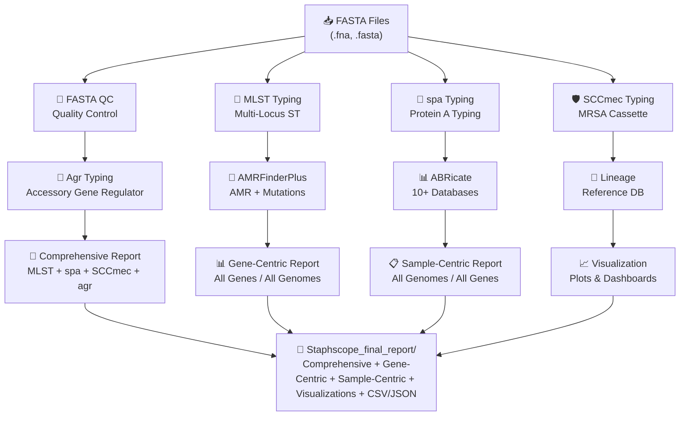

<p align="center">
  
</p>

<div align="center">

# 🔬 StaphScope

### **A species-optimized computational pipeline for rapid, accessible *Staphylococcus aureus* genotyping and surveillance**

#### **Complete MRSA/MSSA genomic analysis in minutes — not hours**

[](CODE_OF_CONDUCT.md)


[](https://doi.org/10.1186/s12864-026-12609-x)

[](https://hub.docker.com/r/bbeckleyhub/staphscope)
[](https://hub.docker.com/r/bbeckleyhub/staphscope)
[](https://hub.docker.com/r/bbeckleyhub/staphscope)
[](#)
[](https://www.linkedin.com/in/brown-beckley-190315319)
[](#)


[](https://github.com/bbeckley-hub/staphscope-typing-tool)
[](https://github.com/bbeckley-hub/staphscope-typing-tool)
[](https://github.com/bbeckley-hub/staphscope-typing-tool)
[](https://github.com/ellerbrock/open-source-badges/)
[](https://github.com/bbeckley-hub/staphscope-typing-tool)

[](https://bbeckley-hub.github.io/staphscope-typing-tool)
[](https://www.sphinx-doc.org/)
[](https://github.com/bbeckley-hub/staphscope-typing-tool/commits)
[](https://github.com/bbeckley-hub/staphscope-typing-tool/graphs/contributors)
[](https://github.com/PyCQA/bandit)

[](https://github.com/psf/black)
[](https://pycqa.github.io/isort/)
[](https://github.com/astral-sh/ruff)
[](https://github.com/pre-commit/pre-commit)
[](https://github.com/bbeckley-hub/pseudoscope/actions)
[](https://github.com/bbeckley-hub/staphscope-typing-tool/tests)
[](https://gitpod.io/#https://github.com/bbeckley-hub/staphscope-typing-tool)

[](https://github.com/bbeckley-hub/staphscope-typing-tool#performance-benchmarks)
[](https://staphscope.dpdns.org)
[](https://github.com/bbeckley-hub/staphscope-typing-tool)
[](https://github.com/bbeckley-hub/staphscope-typing-tool)
[](https://github.com/bbeckley-hub/staphscope-typing-tool#ai-integration-guide)

[](https://www.python.org/downloads/)
[](https://docs.conda.io/en/latest/)
[](LICENSE)
[](https://github.com/bbeckley-hub/staphscope-typing-tool/issues)
[](https://github.com/bbeckley-hub/staphscope-typing-tool/stargazers)
[](https://htmlpreview.github.io/?https://bbeckley-hub.github.io/staphscope-typing-tool/#summary)

[](https://scholar.google.com/citations?user=CYNOsqIAAAAJ&hl=en)


[](https://git.io/streak-stats)

**Two ways to use StaphScope:**  
🖥️ **Command-line tool** for high-throughput, local analysis  
🌐 **StaphScope Web** for non-bioinformaticians – [https://staphscope.dpdns.org](https://staphscope.dpdns.org)

</div>

---

## 🐛 **Bug Fixes in v1.3.1** (July 2026)

- **Ultimate Reporter (gene‑centric) & Sample‑Centric Reporter** – Fixed `TypeError` when sorting agr types with `np.nan` values. Now filters non‑string keys before sorting, preventing report generation crashes.
- **Visualization Module** – Now loads agr data directly from `agr_summary.tsv` (no longer relying solely on the comprehensive HTML). Added dynamic AMRfinder table detection to avoid `IndexError`; updated boxplot call to remove deprecated `labels` parameter (compatibility with matplotlib ≥3.9).
- **General Stability** – Improved error handling across multiple modules to ensure robust execution even with incomplete or malformed input files.

---

## 🎉 **What's New in v1.3.0** (July 2026)

- **🧬 Agr Typing Module** – Full integration of **AgrVATE** (Raghuram et al., 2022) for accessory gene regulator (agr) typing. Now you can determine agr types I‑IV, with all combinations: agr‑MLST, agr‑spa, agr‑SCCmec, and **four‑way typing (ST‑spa‑SCCmec‑agr)**. The Ultimate Reporter includes a dedicated agr tab with distribution, sample lists, and all combinations.

- **🔄 Updated spa Database (Ridom SpaServer – July 2026)** – The spa typing database has been updated to the latest version from Ridom SpaServer, now featuring:
  - **22,727 spa types** (up from ~20,000)
  - **864 unique repeat patterns**
  - **471,555 total strains** in the database
  - **196,047 strain records**
  - **183 countries** with strain records
  - **964 registered users** from **81 countries**
  
  This ensures the most accurate and up‑to‑date spa typing results for outbreak tracking and epidemiological studies.

- **📊 Sample‑Centric Reporter (NEW!)** – A completely new interactive HTML report that shows **each genome** as an interactive box with all its genes. Perfect for drill‑down analysis: filter by sample name or database, view per‑sample gene lists for AMR, Virulence, BACMET, Plasmids, and Mutations. This is the **opposite** of the gene‑centric report – now you have both!

- **🔁 Full Dynamic Grouping by All Typing Schemes** – The grouping feature (introduced in v1.2.3) now supports **agr** and **all combinations**: MLST, spa, SCCmec, agr, ST‑spa, ST‑SCCmec, spa‑SCCmec, ST‑agr, spa‑agr, SCCmec‑agr, ST‑spa‑agr, ST‑SCCmec‑agr, spa‑SCCmec‑agr, **Triple (ST‑spa‑SCCmec)**, and **Four‑way (ST‑spa‑SCCmec‑agr)**. Instantly see which clones carry specific genes or mutations.

- **🚀 HPC‑friendly Orchestrator v1.3.0** – Every module now runs in an isolated `/tmp` directory with **automatic cleanup**. Signal handlers for Ctrl+C clean up all temp dirs gracefully. Proper file copying for the sample‑centric module ensures it gets `mutation_summary.tsv`, `staphscope_comprehensive_report.html`, `.json`, `.tsv`, and all required TSVs.

- **🐛 Bug Fixes & Stability** – Fixed the spa typing `ValueError` caused by malformed lines in `spatypes.txt`. The module now automatically cleans the types file before execution, making it robust against future database formatting issues.

- **📚 Expanded Documentation & Attribution** – Complete wiki with 12+ pages: Home, Installation, Quick Start, Module Descriptions, Agr Typing Guide, Grouping Feature, Understanding the Reports, AI Integration, Citation & Acknowledgments, Troubleshooting, Contributing, and Docker Guide. All tools and databases are now properly credited.

- **🔗 Updated spa Database Files** – The `sparepeats.fasta`, `spaTyper`, and `spatypes.txt` files have been updated to the latest Ridom SpaServer release (July 2026), ensuring accurate and comprehensive spa typing results.

---

## 📋 **Table of Contents**

- [🎯 Overview](#-overview)
- [✨ Key Features](#-key-features)
- [🆕 What’s New in v1.3.0](#-whats-new-in-v130-july-2026)
- [🌐 StaphScope Web Platform](#-staphscope-web-platform)
- [⚡ Quick Start (CLI)](#-quick-start-cli)
- [🔧 Installation (CLI)](#-installation-cli)
- [🐳 Staphscope Docker & Singularity Usage](#-staphscope-docker--singularity-usage)
- [🔗 Integrated External Tools & Dependencies](#-integrated-external-tools--dependencies)
- [🚀 Usage Guide (CLI)](#-usage-guide-cli)
- [📁 Output Structure](#-output-structure)
- [🔍 Analytical Modules](#-analytical-modules)
- [📈 Performance Benchmarks](#-performance-benchmarks)
- [🔬 Validation & Accuracy](#-validation--accuracy)
- [🤖 AI Integration Guide](#-ai-integration-guide)
- [🔮 Future Development](#-future-development)
- [❓ Frequently Asked Questions](#-frequently-asked-questions)
- [🐛 Troubleshooting](#-troubleshooting)
- [📚 Citation](#-citation)
- [🙏 Acknowledgements](#-acknowledgements)
- [👥 Authors & Contact](#-authors--contact)
- [📄 License](#-license)
- [📚 Third-Party Tool Citations](#-third-party-tool-citations)

---

## 🎯 **Overview**

**StaphScope** is an automated, locally-executable computational pipeline designed specifically for comprehensive *Staphylococcus aureus* genomic surveillance. It addresses the critical bottleneck in MRSA research by integrating **seven essential genotyping methods** into a single, cohesive workflow.

### 🌍 **The Problem**
- **Fragmented Bioinformatics**: Traditional MRSA analysis requires 5+ separate tools with conflicting dependencies.
- **Resource Barriers**: Web-based services need constant internet and raise data privacy concerns.
- **Time Constraints**: Generalist platforms take hours; outbreaks need answers in minutes.
- **Interpretation Challenges**: Raw data without epidemiological context limits actionable insights.

### 💡 **Our Solution**
StaphScope delivers:
- **✅ Single-command installation** via Conda.
- **✅ 10-14 minute complete analysis** (24 samples, 16 cores).
- **✅ 100% local execution** with data privacy.
- **✅ Intelligent resource management** using Python's psutil library.
- **✅ Interactive HTML reports** with epidemiological context.
- **✅ Automated MRSA/MSSA classification** with confidence scoring.
- **✅ Web-based interface** for non-bioinformaticians.

**Perfect for**: Clinical labs, outbreak investigations, research studies, and public health surveillance.

---

## ✨ **Key Features**

### 🔬 **Core Analytical Modules**

| Module | 🎯 Purpose | 📊 Key Outputs | ⚡ Speed |
|--------|------------|----------------|----------|
| **FASTA QC** | Comprehensive quality control (N50, GC%, contig stats) | HTML, TSV, JSON reports | <30 sec |
| **MLST Typing** | Phylogenetic classification via 7 housekeeping genes | ST, CC, allele profiles | <1 min |
| ***spa* Typing** | Hypervariable region analysis of protein A gene | *spa* type, repeat patterns | <1 min |
| **SCC*mec* Typing** | Methicillin resistance cassette characterization | SCC*mec* type (I-XIII), confidence scores | 1-2 min |
| **Agr Typing** (NEW) | Accessory gene regulator (agr) type determination | agr type I-IV, group, status | <1 min |
| **AMR Profiling** | Comprehensive resistance gene detection (AMRFinderPlus) | 5,000+ AMR genes, risk categorization | 2-3 min |
| **ABRicate Screening** | Multi-database virulence/plasmid detection (10 DBs) | Plasmid replicons, virulence factors | 3-4 min |
| **Visualization Suite** | Publication-ready graphics using seaborn, plotly, matplotlib | 14+ graph types in PDF, PNG, SVG, HTML | 1-2 min |
| **Lineage Database** | Global epidemiological context | 50 major lineages, geographical distribution | Instant |

### 📊 **Sample Integrated Report**

Curious what the output looks like? Click the badge below to view a fully interactive HTML report generated by StaphScope (contains real *S. aureus* typing, AMR, virulence, mutations, and dynamic grouping).

[](https://htmlpreview.github.io/?https://bbeckley-hub.github.io/staphscope-typing-tool/#summary)

> **Note:** The preview may take a few seconds to load. For the best experience, download the HTML file and open it locally.

### 🛡️ **MRSA-Specific Innovations**
- **Automated MRSA Classification**: Based on concurrent *mecA/mecC* + SCC*mec* detection.
- **Clinical Gene Flagging**: Automatic highlighting of PVL, enterotoxins, *van* genes.
- **Risk Assessment**: Categorizes genes as 'Critical Risk' (e.g., *mecA*, *vanA*) or 'High Risk'.
- **Cross-Genome Pattern Discovery**: Summarizes gene frequencies across entire sample sets.
- **Curated Lineage Database**: 50 major lineages with HA-MRSA, CA-MRSA, LA-MRSA classifications.

### 🚀 **v1.3.0 Exclusive Features**

#### 🧬 **Agr Typing Module** (NEW)
- **AgrVATE integration** – Uses [AgrVATE](https://github.com/VishnuRaghuram94/AgrVATE) (Raghuram et al., 2022) for accurate agr typing.
- **Dedicated agr tab** – Full agr type distribution (I‑IV), samples by agr type, and all combinations:
  - agr‑MLST
  - agr‑spa
  - agr‑SCCmec
  - agr‑MLST‑spa
  - agr‑MLST‑SCCmec
  - agr‑spa‑SCCmec
  - **Four‑way (agr‑MLST‑spa‑SCCmec)**
- **Why it matters:** Agr type correlates with virulence potential and epidemiological lineage. Agr dysfunction is linked to persistent infections.

#### 📊 **Sample‑Centric Reporter** (BRAND NEW)
- **Interactive isolate boxes** – Each genome displayed as a box with:
  - MLST, spa, SCCmec, MRSA/MSSA status, and agr type as color‑coded badges
  - Per‑sample gene lists for AMR, Virulence, BACMET, Plasmids, and Mutations
- **Horizontally scrollable tables** – No truncation, all genes visible.
- **Filter by sample name or database** – Quickly find specific isolates.
- **Why it matters:** Perfect for detailed case‑by‑case investigation, clinical decision‑making, and presenting results to non‑bioinformaticians.

#### 🔁 **Full Dynamic Grouping with Agr**
- Now includes **agr** and **all combinations**:
  - MLST, spa, SCCmec, agr
  - ST‑spa, ST‑SCCmec, spa‑SCCmec
  - ST‑agr, spa‑agr, SCCmec‑agr
  - ST‑spa‑agr, ST‑SCCmec‑agr, spa‑SCCmec‑agr
  - **Triple (ST‑spa‑SCCmec)**
  - **Four‑way (ST‑spa‑SCCmec‑agr)**
- **Instantly see** which clones carry specific genes or mutations.
- **Outbreak investigation:** Identify the exact clone (ST‑spa‑SCCmec‑agr) driving an outbreak.

#### 🖥️ **HPC‑friendly Orchestrator v1.3.0**
- **All modules run in isolated `/tmp` directories** – no cross‑run contamination, no permission errors, no leftover files.
- **Graceful signal handling** – Ctrl+C cleans up all temp dirs.
- **Proper file copying** – Sample‑centric module now gets `mutation_summary.tsv` and all comprehensive report files.
- **Clean final output** – `Staphscope_final_report` contains only the two report directories and comprehensive files.

---
## 📊 StaphScope Workflow



---

## ✨ **Key Features**

## 🌐 **StaphScope Web Platform**

For researchers and clinicians who prefer a graphical interface, **StaphScope Web** provides all the power of the command-line tool in an easy-to-use web application.

### **Key Web Features**
- ✅ **Drag-and-drop file upload** (single, multiple, or ZIP archives)
- ✅ **Module selection** – choose which analyses to run
- ✅ **Real-time progress monitoring** with live logs
- ✅ **Beautiful HTML reports** with interactive visualizations
- ✅ **Download all results as a single ZIP** file
- ✅ **Responsive design** – works on desktop and tablet
- ✅ **No installation required** – works in any modern browser

### **Technology Stack**
- **Backend**: Flask (Python web framework)
- **Task Queue**: Celery with Redis broker
- **Bioinformatics Engine**: StaphScope CLI (via Conda)
- **Frontend**: Bootstrap 5, JavaScript
- **Deployment**: Gunicorn + Nginx

### **Quick Access**
> 🌐 **Try StaphScope Web today:** [https://staphscope.dpdns.org](https://staphscope.dpdns.org)  
> 📦 **Web Repository:** [https://github.com/bbeckley-hub/staphscope-web](https://github.com/bbeckley-hub/staphscope-web)

*Note: The web version limits uploads to 10 files per job for fair resource usage. For larger datasets, please use the command-line tool.*

*Note: Currently hosted on personal infrastructure; availability may vary as we work toward sustainable 24/7 hosting.*

---

## ⚡ **Quick Start (CLI)**

### **Install in 60 seconds**
```bash
# Method 1: Conda (Recommended)
conda create -n staphscope -c conda-forge -c bioconda staphscope -y
conda activate staphscope

# Method 2: Mamba (Faster installation)
mamba create -n staphscope -c conda-forge -c bioconda staphscope -y
mamba activate staphscope

# Method 3: From source (advanced – needs external databases)
git clone https://github.com/bbeckley-hub/staphscope-typing-tool.git
cd staphscope-typing-tool
conda env create -f environment.yml
conda activate staphscope
pip install -e .
```

### **Run your first analysis**
```bash
# Single genome
staphscope -i genome.fasta -o results/

# Batch processing (24 genomes)
staphscope -i "*.fna" -o batch_results --threads 16
# Complete in ~14 minutes! 🎉
```

---

## 🔧 **Installation (CLI)**

### **System Requirements**
| Resource | Minimum | Recommended | Production |
|----------|---------|-------------|------------|
| **CPU Cores** | 2 | 8+ | 16+ |
| **RAM** | 4 GB | 8 GB | 16 GB |
| **Storage** | 2 GB | 10 GB | 50 GB+ |
| **OS** | Linux, macOS, WSL2 | Linux | Linux Cluster |

### **Step-by-Step Installation**

#### **1. Install Miniconda (if needed)**
```bash
wget https://repo.anaconda.com/miniconda/Miniconda3-latest-Linux-x86_64.sh
bash Miniconda3-latest-Linux-x86_64.sh
source ~/.bashrc
```

#### **2. Install StaphScope**
```bash
# Add channels in correct order
conda config --add channels conda-forge
conda config --add channels bioconda

# Create and activate environment
conda create -n staphscope -c conda-forge -c bioconda staphscope -y
conda activate staphscope

# Verify installation
staphscope --help
```

#### **3. Update Databases (Recommended)**
```bash
# For ABRicate databases
abricate --setupdb

# For AMR database (first run or manual update)
staphscope --update-amr-db   # incremental
# or
staphscope --force-update-amr-db   # full overwrite
```

---

## 🐳 **StaphScope Docker & Singularity Usage – avoid the padlock 🔓**

By default, Docker runs containers as `root`, so any files written to bind‑mounted directories will be owned by `root:root` – resulting in padlock icons and the need for `sudo chown`. **The fix is simple:** add `-u $(id -u):$(id -g)` to run the container with your host user’s UID/GID.

```bash
# Pull the latest image
docker pull bbeckleyhub/staphscope:latest

# Test installation
docker run --rm bbeckleyhub/staphscope:latest --help

# ✅ Recommended (no padlock, no sudo chown)
docker run --rm \
  -u $(id -u):$(id -g) \
  -v $(pwd):/data \
  bbeckleyhub/staphscope:latest \
  -i "/data/*.fasta" -o /data/output -t 4

# ❌ Old way (creates root‑owned files)
docker run --rm \
  -v $(pwd):/data \
  bbeckleyhub/staphscope:latest \
  -i "/data/*.fasta" -o /data/output -t 4
# Then you need: sudo chown -R $USER:$USER ./output
```

**Why `-u $(id -u):$(id -g)`?**  
- It tells Docker to run the container’s process with the same UID and primary GID as your host user.  
- All files created in the mounted volume will be owned by **you** – no padlock, no permission errors, no cleanup.

> **Note for macOS / Windows (Docker Desktop):** UID/GID mapping works out‑of‑the‑box. The same command works fine.

---

### **Singularity / Apptainer (HPC clusters – no `sudo`, correct ownership)**  

Because StaphScope v1.3.0 writes all temporary files to `/tmp` (world‑writable), **you no longer need the `--writable-tmpfs` flag** (unless your cluster restricts `/tmp`). Singularity automatically maps your host user ID, so output files are **always** owned by you – no extra flags required.

```bash
# Pull the SIF image (once)
singularity pull staphscope.sif docker://bbeckleyhub/staphscope:latest

# Run – files are owned by your HPC user automatically
singularity run -B $(pwd):/data staphscope.sif -i "/data/*.fasta" -o /data/output

# If your cluster restricts `/tmp`, add `--writable-tmpfs` for safety:
singularity run --writable-tmpfs -B $(pwd):/data staphscope.sif -i "/data/*.fasta" -o /data/output
```

**Why Singularity users have no padlock:**  
- Singularity/Apptainer **never** runs as root on HPC clusters; it always maps your host UID/GID into the container.  
- The `-B` bind‑mount preserves ownership, so all output files are created with your user credentials.

---

### **Summary for HPC admins and Docker users**

| Platform | Command (recommended) | Ownership of output files |
|----------|----------------------|---------------------------|
| **Docker** | `docker run --rm -u $(id -u):$(id -g) -v "$PWD:/data" bbeckleyhub/staphscope ...` | Your user |
| **Singularity** | `singularity run -B "$PWD:/data" staphscope.sif ...` | Your user (automatically) |

No more `sudo chown`, no more padlock icons, no more angry HPC emails.

---

## 🔗 **Integrated External Tools & Dependencies**

| Tool/Database | Purpose | Source | License |
|---------------|---------|--------|---------|
| **MLST** | Multi-locus sequence typing | [tseemann/mlst](https://github.com/tseemann/mlst) | GPL v2 |
| **ABRicate** | Mass screening for resistance/virulence | [tseemann/abricate](https://github.com/tseemann/abricate) | GPL v2 |
| **AMRFinderPlus** | Antimicrobial resistance gene detection | [ncbi/amr](https://github.com/ncbi/amr) | Public Domain |
| **SCCmecFinder** | SCCmec typing | [genomicepidemiology/Sccmecfinder](https://bitbucket.org/genomicepidemiology/Sccmecfinder) | Apache-2.0 |
| **Agr** | Agr typing (NEW) | [VishnuRaghuram94/AgrVATE](https://github.com/VishnuRaghuram94/AgrVATE) | MIT |
| **spa typing** | *spa* gene typing | [spa.ridom.de](https://spa.ridom.de/) | Free for academic use |
| **PubMLST** | MLST allele database | [pubmlst.org](https://pubmlst.org/organisms/staphylococcus-aureus) | Open access for research |

---

## 🚀 **Usage Guide (CLI)**

### **Basic Commands**
```bash
# Single genome
staphscope -i genome.fasta -o results/

# Batch processing with wildcards
staphscope -i "*.fna" -o results_2025 --threads 8

# Skip specific modules (including new agr and sample-centric)
staphscope -i sample.fna -o results --skip-spa --skip-lineage --skip-agr

# Skip the new sample-centric reporter
staphscope -i "*.fna" -o results --skip-sample-centric

# AMR with custom thresholds and no mutations
staphscope -i "*.fna" -o results --amr-min-identity 0.95 --amr-min-coverage 0.9 --skip-amr-mutations
```

### **Input Formats**
- Accepted: `.fna`, `.fasta`, `.fa`, `.fn`
- Required: Assembled genomes (contigs or complete)
- Batch patterns: `*.fasta`, `sample_*.fna`, etc.

### **Real-World Examples**

#### **Clinical Laboratory Setting**
```bash
# Daily surveillance of 12 isolates
staphscope -i "daily_isolates/*.fasta" -o /mnt/shared/surveillance/$(date +%Y%m%d) --threads 12
# Complete in ~8 minutes
```

#### **Outbreak Response**
```bash
# Urgent investigation (8 suspected cases) – skip lineage to save time
staphscope -i "outbreak/*.fasta" -o /tmp/urgent_analysis --skip-lineage
# Results in ~4 minutes
```

#### **Force AMR database update before analysis**
```bash
staphscope -i "*.fna" -o results --amr-force-update
```

---

## 📁 **Output Structure**

StaphScope generates a comprehensive, organized output directory:

```
batch_results/
├── abricate_results/          # Multi-database screening (10 DBs)
├── agr_results/               # Agr typing results (NEW)
├── fasta_qc_results/          # FASTA quality control
├── lineage_results/           # Phylogenetic lineage reference
├── mlst_results/              # MLST typing
├── sccmec_results/            # SCCmec typing
├── spa_results/               # spa typing
├── staph_amrfinder_results/   # AMR gene profiling (incl. mutation files)
├── Staphscope_final_report/   # Consolidated final reports (only source)
│   ├── staphscope_comprehensive_report.html
│   ├── staphscope_comprehensive_report.json
│   ├── staphscope_comprehensive_report.tsv
│   ├── STAPHSCOPE_ULTIMATE_GENE_CENTRIC_REPORTS/         # Gene‑centric report
│   │   ├── staphscope_ultimate_gene_centric_report.html
│   │   ├── staphscope_ultimate_gene_centric_report.json
│   │   ├── amr_genes.csv
│   │   ├── virulence_genes.csv
│   │   ├── bacmet_genes.csv
│   │   ├── mutations.csv
│   │   ├── plasmid_replicons.csv
│   │   ├── sample_overview.csv
│   │   ├── pattern_discovery.csv
│   │   └── fasta_qc.csv
│   └── STAPHSCOPE_ULTIMATE_SAMPLE_CENTRIC_REPORTS/  # Sample‑centric report (NEW)
│       ├── staphscope_ultimate_sample_centric_report.html
│       ├── staphscope_ultimate_sample_centric_report.json
│       └── ... (same CSV files as gene‑centric)
├── STAPHSCOPE_VISUALIZATIONS/ # Publication‑ready plots (PNG, SVG, PDF)
└── staphscope_run.log         # Detailed log file
```

**Note:** In v1.3.0, `Staphscope_final_report` contains **only** the two report directories and comprehensive files – no other module directories are copied. The top‑level copies are automatically deleted.

---

## 🔍 **Analytical Modules**

### **1. FASTA QC**
- **Metrics**: N50/N70/N90, L50/L70/L90, GC content, total length, contig count
- **Outputs**: HTML reports with histograms, TSV/JSON for downstream analysis

### **2. MLST Typing**
- **Database**: PubMedST *S. aureus*
- **Method**: BLAST-based allele calling
- **Output**: ST, CC, 7-gene profile, epidemiological context

### **3. *spa* Typing**
- **Database**: Ridom *spa* repeat database
- **Method**: BLAST against repeat sequences
- **Output**: *spa* type, repeat pattern, alignment metrics

### **4. SCC*mec* Typing**
- **Method**: Hierarchical two-method system (gene-based + k-mer homology)
- **Output**: SCC*mec* type (I-XIII), confidence scores, *mec*/*ccr* complexes
- **Subtyping**: Types IV and V community-associated cassettes

### **5. Agr Typing (NEW)**
- **Method**: AgrVATE (Raghuram et al., 2022)
- **Output**: agr type (I-IV), group, match score, status
- **Integration**: Dedicated tab in Ultimate Reporter; color‑coded badges in Sample‑centric report

### **6. AMR Profiling**
- **Tool**: NCBI-AMRFinderPlus v4.2.7 
- **Coverage**: 5,000+ AMR genes
- **Risk Assessment**: Critical Risk (*mecA*, *vanA*, *cfr*), High Risk (*erm*, *tetM*)
- **Mutation reporting**: All point mutations (synonymous + non‑synonymous) by default

### **7. ABRicate Screening**
- **Databases**: VFDB, ResFinder, CARD, PlasmidFinder, MegaRes, NCBI, ARG-ANNOT, ECOH, EcoLi_VF, BacMet2
- **Thresholds**: ≥80% identity and coverage
- **Clinical Flags**: PVL, enterotoxins, *van* genes

### **8. Visualization Suite**
- **Libraries**: seaborn, plotly, matplotlib
- **Plot Types**: Box plots, violin plots, bar charts, heatmaps, correlation matrices, pie charts, line graphs
- **Formats**: PNG, SVG, PDF, interactive HTML

### **9. Lineage Database**
- **Content**: 50 major *S. aureus* lineages (18 HA-MRSA, 19 CA-MRSA, 7 LA-MRSA)
- **Metadata**: Geographical distribution, clinical significance, outbreak potential

---

## 📈 **Performance Benchmarks**

| System | Samples | Time | Speed vs Bactopia |
|--------|---------|------|-------------------|
| Laptop (2 cores, 8GB) | 1 | 2m 33s | 5× faster |
| Laptop (2 cores, 8GB) | 24 | 28m 17s | 6× faster |
| Workstation (16 cores, 16GB) | 1 | 1m 31s | 8× faster |
| Workstation (16 cores, 16GB) | 24 | 14m 34s | 10× faster |
| Workstation (16 cores, 16GB) | 100 | ~60m | 12× faster |

### **Resource Efficiency**
- **Memory Usage**: 2-4 GB typical, scales linearly
- **Storage**: ~100 MB per sample
- **CPU**: Dynamic allocation via psutil

---

## 🔬 **Validation & Accuracy**

### **Reference Strain Validation**
**100% concordance** with gold‑standard reference genomes:

| Reference Strain | Expected Type | StaphScope Result |
|------------------|---------------|-------------------|
| USA300 | ST8–t008–IV(2B) | ✅ ST8–t008–IV(2B) |
| N315 | ST5–t002–II(2A) | ✅ ST5–t002–II(2A) |
| MRSA252 | ST36–t018–II(2A) | ✅ ST36–t018–II(2A) |
| TW20 | ST239–t037–III(3A) | ✅ ST239–t037–III(3A) |
| NCTC8325 | ST8–t211–None | ✅ ST8–t211–Not Assigned |


### **Clinical Isolate Analysis (n=24)**
- **MRSA**: 21 isolates (87.5%)
- **MSSA**: 3 isolates (12.5%)
- **Dominant STs**: ST5 (9), ST8 (5), ST22 (2)
- **Agr Types**: I (10), II (12), III (2)
- **Critical Genes**: *mecA* (21), *mecC* (1), *fosB* (20)
- **PVL**: 7 isolates (29.2%), all ST8/ST59
- **Plasmids**: 14/24 genomes (58.3%) with plasmid replicons

---

## 🤖 **AI Integration Guide**

StaphScope generates comprehensive HTML and JSON reports that are **perfect for AI analysis**. Here's how to use AI tools to get more from your data.

### 🚀 Quick Start
1. **Install any AI browser extension** (ChatGPT, Claude, Gemini)
2. **Open your report**: `staphscope_ultimate_gene_centric_report.html`
3. **Select text** in any section (AMR Genes, MLST Analysis, etc.)
4. **Right-click → Ask AI** with your question

### 💡 Example Questions

**For MLST Analysis:**
- "What is the clinical significance of ST5 vs ST8?"
- "Which samples are MRSA and what ST are they?"

**For Agr Typing (NEW):**
- "What is the agr type distribution in this dataset?"
- "Which STs are associated with agr type II?"
- "Are MRSA isolates more likely to have a specific agr type?"

**For AMR Genes (using grouping):**
- "Which STs carry mecA? Use the grouping button 'MLST' in the AMR tab and tell me what you see."
- "List all samples with vancomycin resistance genes and their SCCmec types."

**For Virulence Factors:**
- "Which samples carry PVL toxin? Group them by spa type."
- "Are there any high‑risk virulence combinations with TSST‑1?"

**For Mutations:**
- "Which STs carry the linezolid‑resistant 23S rRNA G2576T mutation?"
- "Show me all gyrA mutations and group them by SCCmec type."

**For Pattern Discovery:**
- "Are there correlations between ST and specific genes?"
- "What are the most frequent four‑way typing combinations (ST‑spa‑SCCmec‑agr)?"

### 📊 Pro Tips
- **Provide context**: "I'm analyzing *S. aureus* genomics data..."
- **Be specific**: Instead of "tell me about this", ask "what does SCCmec type IV indicate?"
- **Ask for interpretations**: "What are the clinical implications of these findings?"
- **Request summaries**: "Summarize the resistance profile of sample XYZ"

### ⚡ Why This Works
StaphScope reports are structured with clear tables and organized data that AI can easily understand. The **grouping feature** makes it trivial for AI to identify clone‑specific patterns.

> *"AI provides powerful insights but always verify critical findings with domain experts."*

---

## 🔮 **Future Development**

### **🚀 Upcoming Features (2026-2027)**
- **Raw read support** – Direct FASTQ analysis with integrated assembly (Snippy).
- **Machine learning module** – Outbreak prediction, phenotype inference, risk scoring.
- **Real‑time database updates** – Live synchronization of lineage and AMR databases.
- **Plugin system** – Community‑contributed analysis modules.
- **Expanded ESKAPE coverage** – Porting StaphScope's architecture to other ESKAPE pathogens.

---

## ❓ **Frequently Asked Questions**

**Q: Is StaphScope free to use?**  
A: Yes! Open‑source under MIT License. Free for academic, clinical, and commercial use.

**Q: What makes StaphScope different from other tools?**  
A: *S. aureus*-optimized, integrates 7 analysis types (including agr), runs 8‑10× faster, and now offers **both gene‑centric and sample‑centric reports** with **full dynamic grouping** including agr and four‑way typing – features no other tool offers.

**Q: Can I use StaphScope for clinical diagnosis?**  
A: StaphScope is a research tool. While highly accurate, results should be validated with orthogonal methods for clinical decision‑making.

**Q: Which version should I use – CLI or Web?**  
A: Use the **Web version** for convenience, small batches (≤10 files), and graphical interface. Use the **CLI version** for large batches (100+ genomes), pipeline integration, or when working with sensitive data locally.

**Q: What is agr typing and why should I care?**  
A: The accessory gene regulator (agr) system controls virulence gene expression. Different agr types are associated with different epidemiological and clinical profiles. Agr dysfunction is linked to persistent infections.

**Q: How do I use the new sample‑centric report?**  
A: After running StaphScope, open `Staphscope_final_report/STAPHSCOPE_ULTIMATE_SAMPLE_CENTRIC_REPORTS/staphscope_ultimate_sample_centric_report.html`. Each sample is shown as an interactive box with all its genes – perfect for detailed isolate investigation.

**Q: Why does v1.3.0 no longer require `--writable-tmpfs` in Singularity?**  
A: All modules now write temporary files to `/tmp` (not to the installation directory). Containers mount `/tmp` as writable by default, so no special flags are needed.

**Q: How do I use the new grouping feature with agr?**  
A: In the Ultimate Reporter, open any gene‑centric tab (AMR, Virulence, BACMET, Plasmids, Mutations). Above the table you’ll see buttons including “agr”, “ST‑agr”, “spa‑agr”, and “Four‑way”. Click one – the genome list reorganises instantly by that typing scheme.

---

## 🐛 **Troubleshooting**

### **Common Issues & Solutions**

```bash
# Issue: AMR database missing or outdated
# Solution:
staphscope --force-update-amr-db

# Issue: ABRicate database not found
# Solution:
abricate --setupdb

# Issue: Permission errors in Docker
# Solution: Ensure bind mounts are correct and use --user if needed
docker run --rm -u $(id -u):$(id -g) -v ... bbeckleyhub/staphscope ...

# Issue: Cross‑run contamination in /tmp
# Solution: Use --keep-temp only for debugging; otherwise temp dirs are auto‑deleted.
```

### **Getting Help**
1. **Check existing issues**: [GitHub Issues](https://github.com/bbeckley-hub/staphscope-typing-tool/issues)
2. **Search closed issues**: Many problems already solved
3. **Create new issue**: Include:
   - Full error message
   - Conda environment list (`conda list`)
   - Example command that failed
   - The `staphscope_run.log` file
4. **Email support**: brownbeckley94@gmail.com (response within 48 hours)

---

## 📚 **Citation**

If you use StaphScope in your research, please cite:

> Beckley, B., Amarh, V. (2026). StaphScope: a species‑optimized computational pipeline for rapid and accessible *Staphylococcus aureus* genotyping and surveillance. *BMC Genomics*, 27:123.

**DOI**: [10.1186/s12864-026-12609-x](https://doi.org/10.1186/s12864-026-12609-x)

```bibtex
@article{beckley2026staphscope,
  title={StaphScope: a species‑optimized computational pipeline for rapid and accessible Staphylococcus aureus genotyping and surveillance},
  author={Beckley, Brown and Amarh, Vincent},
  journal={BMC Genomics},
  volume={27},
  pages={123},
  year={2026},
  doi={10.1186/s12864-026-12609-x}
}
```

### **Software Citation**
```bibtex
@software{staphscope2026,
  author = {Brown Beckley},
  title = {StaphScope: A species-optimized computational pipeline for Staphylococcus aureus genotyping},
  year = {2026},
  publisher = {GitHub},
  url = {https://github.com/bbeckley-hub/staphscope-typing-tool}
}
```

### **Integrated Tool Citations**
Please also cite the essential tools that make StaphScope possible (see BibTeX in the repository).

---

## 🙏 **Acknowledgements**

StaphScope stands on the shoulders of giants. We are deeply grateful to:

- **Torsten Seemann** for MLST, ABRicate, and countless foundational tools.
- **NCBI team** for AMRFinderPlus.
- **CGE team** for SCCmecFinder and database curation.
- **Vishnu Raghuram & Robert A. Petit III** for AgrVATE (agr typing).
- **PubMedST, Ridom, CARD, VFDB** for essential databases.
- **Python community** for Biopython, pandas, plotly, seaborn, matplotlib.
- **Early adopters and beta testers** for invaluable feedback.
- **Peer reviewers & Editorial Team @ BMC GENOMICS** for their constructive feedback, which significantly strengthened this tool and its manuscript.

> *"If we ever meet in person, the drinks are on me!" – Brown Beckley*

---

## 👥 **Authors & Contact**

**Brown Beckley** (Primary Developer)  
- University of Ghana Medical School  
- 📧 brownbeckley94@gmail.com  
- 🐙 GitHub: [bbeckley-hub](https://github.com/bbeckley-hub)  
- LinkedIn: [@brownbeckley](https://www.linkedin.com/in/brown-beckley-190315319/)  
- 📞 +233 508820617

**Amarh Vincent** (Co-Author)  
- University of Ghana Medical School

### **Collaboration Opportunities**
We welcome collaborations on:
- MRSA epidemiology studies
- Clinical validation projects
- Bioinformatics tool development
- Global surveillance initiatives
- Public health applications
- Expanding to other ESKAPE pathogens

---

## 📄 **License**

### Core StaphScope Code
The StaphScope pipeline code (the workflow engine, report generation, HTML templates, and Python modules written by the authors) is licensed under the **MIT License** – see the [LICENSE](LICENSE) file for details.

### StaphScope Web Code
The web interface is also open-source and available under the MIT License in its [separate repository](https://github.com/bbeckley-hub/staphscope-web).

### Third-Party Tools
StaphScope executes several external bioinformatics tools, which are installed as Conda dependencies. Each tool is the property of its respective developers and is used under its own license. By using StaphScope, you agree to comply with the licenses of these third-party tools.

---

### 📚 **Third-Party Tool Citations**

StaphScope integrates several powerful open-source tools and databases. If you use StaphScope in your research, please also cite the following essential tools:

#### **AgrVATE (NEW)**
```bibtex
@article{raghuram_agrv_2022,
  author = {Raghuram, V. and Alexander, A. M. and Loo, H. Q. and Petit, R. A. 3rd and Goldberg, J. B. and Read, T. D.},
  title = {Species-Wide Phylogenomics of the Staphylococcus aureus Agr Operon Revealed Convergent Evolution of Frameshift Mutations},
  journal = {Microbiology Spectrum},
  volume = {10},
  number = {1},
  pages = {e0133421},
  year = {2022},
  doi = {10.1128/spectrum.01334-21}
}
```

#### **MLST (Torsten Seemann)**
```bibtex
@software{seemann_mlst_2018,
  author = {Seemann, T.},
  title = {MLST: Scan contig files against traditional PubMLST typing schemes},
  year = {2018},
  publisher = {GitHub},
  url = {https://github.com/tseemann/mlst}
}
```

#### **PubMLST (Jolley et al.)**
```bibtex
@article{jolley_pubmlst_2018,
  author = {Jolley, K. A. and Bray, J. E. and Maiden, M. C. J.},
  title = {Open-access bacterial population genomics: {BIGSdb} software, the {PubMLST.org} website and their applications},
  journal = {Wellcome Open Research},
  volume = {3},
  pages = {124},
  year = {2018},
  doi = {10.12688/wellcomeopenres.14826.1}
}
```

#### **ABRicate (Torsten Seemann)**
```bibtex
@software{seemann_abricate_2018,
  author = {Seemann, T.},
  title = {ABRicate: Mass screening of contigs for antimicrobial resistance and virulence genes},
  year = {2018},
  publisher = {GitHub},
  url = {https://github.com/tseemann/abricate}
}
```

#### **AMRFinderPlus (NCBI)**
```bibtex
@article{feldgarden_amrfinderplus_2019,
  author = {Feldgarden, M. et al.},
  title = {AMRFinderPlus and the Reference Gene Catalog facilitate examination of the genomic links among antimicrobial resistance, stress response, and virulence},
  journal = {Scientific Reports},
  volume = {11},
  pages = {12728},
  year = {2019},
  doi = {10.1038/s41598-021-91456-0}
}
```

#### **SCCmecFinder (CGE)**
```bibtex
@article{kaya_sccmecfinder_2018,
  author = {Kaya, H. et al.},
  title = {SCCmecFinder, a Web-Based Tool for Typing of Staphylococcal Cassette Chromosome mec in Staphylococcus aureus Using Whole-Genome Sequence Data},
  journal = {mSphere},
  volume = {3},
  number = {1},
  pages = {e00612-17},
  year = {2018},
  doi = {10.1128/mSphere.00612-17}
}
```

#### ***spa* Typing (Ridom)**
```bibtex
@article{mellmann_spa_typing_2005,
  author = {Mellmann, A. et al.},
  title = {Evidenzbasierte Hygienemassnahmen mittels spa-Typisierung bei MRSA-Häufungen im Krankenhaus},
  journal = {Deutsche Medizinische Wochenschrift},
  volume = {130},
  number = {22},
  pages = {1364-1368},
  year = {2005},
  doi = {10.1055/s-2005-868351},
  note = {Database: https://spa.ridom.de}
}
```

#### **Biopython**
```bibtex
@article{biopython_2009,
  author = {Cock, P. J. A. et al.},
  title = {Biopython: freely available Python tools for computational molecular biology and bioinformatics},
  journal = {Bioinformatics},
  volume = {25},
  number = {11},
  pages = {1422-1423},
  year = {2009},
  doi = {10.1093/bioinformatics/btp163}
}
```

---

### **📊 Database Citations**

#### **CARD (Comprehensive Antibiotic Resistance Database)**
```bibtex
@article{alcock_card_2023,
  author = {Alcock, B. P. et al.},
  title = {CARD 2023: expanded curation, support for machine learning, and resistome prediction at the Comprehensive Antibiotic Resistance Database},
  journal = {Nucleic Acids Research},
  volume = {51},
  number = {D1},
  pages = {D690-D699},
  year = {2023},
  doi = {10.1093/nar/gkac920}
}
```

#### **ResFinder**
```bibtex
@article{bortolaia_resfinder_2020,
  author = {Bortolaia, V. et al.},
  title = {ResFinder 4.0 for predictions of phenotypes from genotypes},
  journal = {Journal of Antimicrobial Chemotherapy},
  volume = {75},
  number = {12},
  pages = {3491-3500},
  year = {2020},
  doi = {10.1093/jac/dkaa345}
}
```

#### **ARG-ANNOT**
```bibtex
@article{gupta_argannot_2014,
  author = {Gupta, S. K. et al.},
  title = {ARG-ANNOT, a new bioinformatic tool to discover antibiotic resistance genes in bacterial genomes},
  journal = {Antimicrobial Agents and Chemotherapy},
  volume = {58},
  number = {1},
  pages = {212-220},
  year = {2014},
  doi = {10.1128/AAC.01310-13}
}
```

#### **VFDB (Virulence Factor Database)**
```bibtex
@article{chen_vfdb_2016,
  author = {Chen, L. et al.},
  title = {VFDB 2016: hierarchical and refined dataset for big data analysis—10 years on},
  journal = {Nucleic Acids Research},
  volume = {44},
  number = {D1},
  pages = {D694-D697},
  year = {2016},
  doi = {10.1093/nar/gkv1239}
}
```

#### **PlasmidFinder**
```bibtex
@article{carattoli_plasmidfinder_2014,
  author = {Carattoli, A. et al.},
  title = {In silico detection and typing of plasmids using PlasmidFinder and plasmid multilocus sequence typing},
  journal = {Antimicrobial Agents and Chemotherapy},
  volume = {58},
  number = {7},
  pages = {3895-3903},
  year = {2014},
  doi = {10.1128/AAC.02412-14}
}
```

#### **BacMet (Biocide & Metal Resistance)**
```bibtex
@article{pal_bacmet_2014,
  author = {Pal, C. et al.},
  title = {BacMet: antibacterial biocide and metal resistance genes database},
  journal = {Nucleic Acids Research},
  volume = {42},
  number = {D1},
  pages = {D737-D743},
  year = {2014},
  doi = {10.1093/nar/gkt1252}
}
```

#### **MEGARes**
```bibtex
@article{doster_megares_2020,
  author = {Doster, E. et al.},
  title = {MEGARes 2.0: a database for classification of antimicrobial drug, biocide and metal resistance determinants in metagenomic sequence data},
  journal = {Nucleic Acids Research},
  volume = {48},
  number = {D1},
  pages = {D561-D569},
  year = {2020},
  doi = {10.1093/nar/gkz1010}
}
```

---

### 📝 **Usage Note**

When citing StaphScope in your publications, please include the main StaphScope citation along with citations for the specific tools and databases you used:

> "Genomic analysis was performed using StaphScope [Beckley & Amarh, 2026], which integrates MLST [Seemann, 2018], ABRicate [Seemann, 2018], AMRFinderPlus [Feldgarden et al., 2019], SCCmecFinder [Kaya et al., 2018], and AgrV [Raghuram et al., 2022] for comprehensive *S. aureus* characterization. Antimicrobial resistance genes were identified using the CARD [Alcock et al., 2023] and ResFinder [Bortolaia et al., 2020] databases. For biocide and heavy metal resistance genes, BacMet [Pal et al., 2014] was used. Virulence and plasmid screening were performed with ABRicate using the VFDB [Chen et al., 2016] and PlasmidFinder [Carattoli et al., 2014] databases."

---

<div align="center">

## **🚀 Ready to revolutionize your MRSA analysis?**

| **Choose Your Platform** | |
|--------------------------|-|
| 🖥️ **Command Line** | For high-throughput, local analysis |
| 🌐 **StaphScope Web** | For non-bioinformaticians – [https://staphscope.dpdns.org](https://staphscope.dpdns.org) |

[](https://github.com/bbeckley-hub/staphscope-typing-tool#-quick-start-cli)
[](https://staphscope.dpdns.org)
[](https://github.com/bbeckley-hub/staphscope-typing-tool/issues)

**From days to minutes. From fragmented to integrated. From data to insights.**

*StaphScope: Precision surveillance for the antibiotic resistance era.*

⭐ **If you find this tool useful, please star the repository!** ⭐

*Join the Fight Against Antimicrobial Resistance*

Antimicrobial resistance (AMR) represents one of the most significant global health threats of our time. We invite researchers, clinicians, and public health professionals to collaborate with us in expanding and validating our database, sharing regional epidemiological data, and advancing AMR surveillance.

**Together, we can enhance global AMR monitoring and develop more effective treatment strategies.**

</div>

